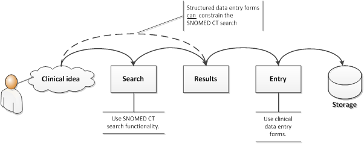

# 1. Introduction

## Purpose of This Guide

This guide provides advice on two related activities that are essential for use of any code system: finding a term and saving the term and related code into the record. The first part of this guide is concerned with searching the content of SNOMED CT to find concepts that represent particular clinical ideas. The second part of the guide is concerned with ways to use SNOMED CT to support entry of relevant clinical information in electronic health records. 

## Who Should Read This Guide

This guide should be read by anyone involved in search and data entry. These people fall into two broad categories: 

### End users of applications that support SNOMED CT-enabled search and data entry

 _These people need:_

  * To be aware of the importance of search features that facilitate efficient and accurate SNOMED CT clinical data entry. 
  * To understand their own data entry requirements in order to select and use configurable search features that meet their needs. 

_This guide provides:_

  * A high-level description of the importance of different search and data entry features
  * Examples of each of the features described.

### Those designing, developing, procuring or evaluating services that include support for SNOMED CT-enabled search and data entry 

_These people need:_

  * To understand the range of search features likely to be important for their users.
  * To be able to develop and deploy search and data entry techniques that provide their users with effective ways to use SNOMED CT as part of the process of clinical record keeping. 

_This guide provides:_

  * Descriptions of search and data entry features which enable successful implementation.
  * Summaries of tried and tested techniques for delivering many of these features.

## What Is Special About Searching SNOMED CT?

At face value it may seem unusual to have a specific guide for searching one terminology. General purpose search routines may seem to be applicable to any list of terms and, by comparison with internet searches, even a terminology with over a million terms does not seem too challenging. However, there are aspects of SNOMED CT that, while presenting challenges to simple searches, also enable enhancements that can deliver highly effective search optimization. 

The size, design and broad scope of SNOMED CT present challenges to simple searches:

  * A large terminology related to healthcare is sure to have lots of terms containing similar words (e.g. 'hip' is in more than 1,200 terms). 
    * What order should these matches be shown in?
  * If two or more words or parts of words are typed what should result be 
    * Which should of these sets should be shown?
  * The same clinical idea can be expressed in different ways 
    * How can it be made easy to find an idea expressed in a different way

The logical design of SNOMED CT allows capture of meaningful clinical information and can also be used to support effective search and data entry strategies. If you see SNOMED CT as simply a long list of terms, then you are probably searching the terminology with a general purpose search tool that has overlooked the opportunities for search refinements offered by the design of the terminology. 

This guide presents practical ways to make terminology searches which lead to accurate and complete clinical noting. While searches need to be fast, response times of a second or two may be acceptable if the displayed results are more relevant. A well-designed search solution should minimize the overall time to take to record clinical information. This guide does not suggest a single approach but identifies ways to address different requirements with appropriate solutions. 

## Search Configuration

Many of the search techniques described in this guide can be applied to a range of different requirements. However, some search techniques require a degree of configuration to meet the needs of particular users and particular types of data collection. 

Various levels of configuration should be considered including:

  * Default configurations for an organization or group of users. For example, specifying the SNOMED CT version, exclusion of inactive concepts and inclusion of various extensions and supporting derivatives; 
  * Settings bound to data input fields that make it easy to enter commonly used values and prevent entry of inappropriate values. For example, limiting entries to a particular subset of SNOMED CT content and prioritizing some members of that set. 
  * User configuration that enables modification while using a front-end application to refine searches. For example, setting the search mode to include complete, partial or pattern based phrase matches or to limit searches to a particular hierarchy. 

## About Search and Data Entry

Search and data entry are closely related and as illustrated in Figure 1 can be regarded as two steps in a single process. A clinical user needs to record a clinical idea (e.g. a sign, symptom, diagnosis or procedure). The user searches for the relevant Concept, views the results, finds the appropriate Concept, selects it for data entry and the data is stored. 

<figure><figcaption>
Figure 1-1: A search and data entry process
</figcaption></figure>

  
Although there is often a close relationship between search and data entry, the two processes also need to be considered separately. This guide has therefore been categorized into two parts: the Search part and the Data Entry part. 

SNOMED CT searches are also required for purposes which are not directly connected to data entry including: 

  * Reviewing terminology content;
  * Creating Reference Sets (e.g. to represent subsets of terms and Concepts);
  * Creating templates and protocols for data entry;
  * Creating queries to retrieve data;
  * Learning about the structure of the terminology;

Please refer to the section "Use cases for searches" for further information.

Users may enter data including SNOMED CT terms using techniques that do not involve consciously searching. These include: 

  * Structured data entry screens with option controls linked to an appropriate SNOMED CT Concepts which are recorded based on the options selected. 
  * Natural language processing (NLP) including tagging of particular phrases with particular Concept identifiers. Please note that NLP techniques are out of scope of this guide. 

For further information about structured data entry techniques, please refer to the "Data Entry" section. 
