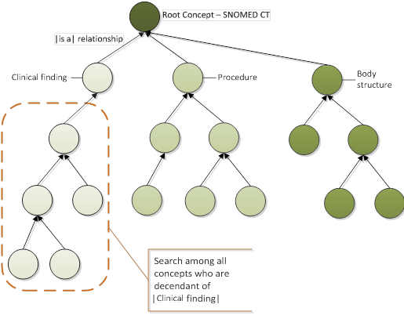
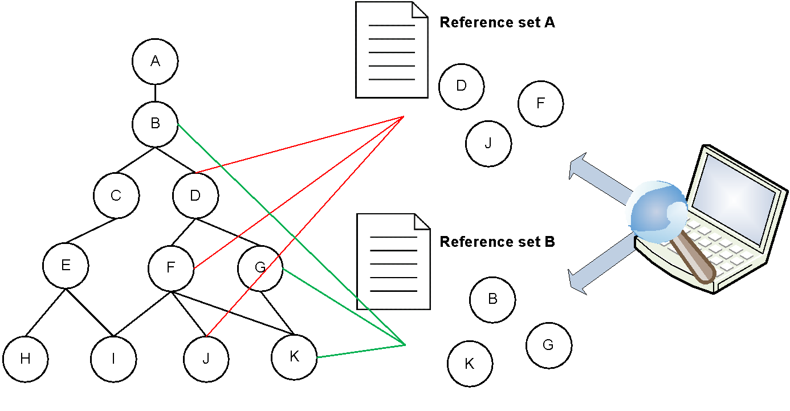
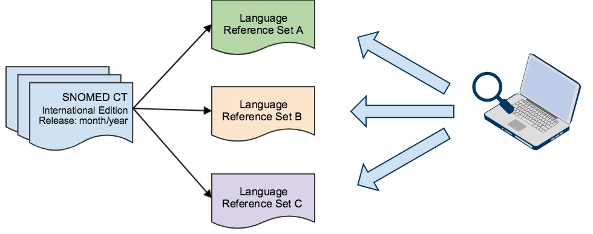

# 2.2 Using SNOMED CT Features to Support Optimized Searches

The logical model of SNOMED CT is able to the support development of search techniques which can support effective and efficient Concept and Description retrieval.

It is however important to be aware that different techniques apply to different types of searches in order to avoid unconstrained searches which can make browsing SNOMED CT like navigating a jungle. This section presents some features of SNOMED CT which can help support effective and efficient searches.

## Benefits of Using SNOMED CT Hierarchies

The <mark style="color:blue;">|</mark> is a <mark style="color:blue;">|</mark> hierarchies in SNOMED CT support searches to be constrained by type, e.g. searches for Concepts which are contained in one of the top-level hierarchies such as <mark style="color:blue;">|</mark> clinical finding <mark style="color:blue;">|</mark> , <mark style="color:blue;">|</mark> body structure <mark style="color:blue;">|</mark> and <mark style="color:blue;">|</mark> procedure <mark style="color:blue;">|</mark> (see [4.4.2. Constrain Searches by Supertype Ancestors](<../4 optimizing-searches/4.4 constrained-searches/4.4.2-constrain-searches-by-supertype-ancestors.md>)).

<figure><figcaption>
Figure 2.2-1: Search by subtype hierarchy
</figcaption></figure>

This type of search limits the number of search candidates significantly, as it excludes all Concepts of types other than those specified by the chosen subtype hierarchy. More granular Concepts than the top-level Concepts can be used as the basis for this type of search. For instance, searching for subtypes of <mark style="color:blue;">|</mark> Cardiovascular finding <mark style="color:blue;">|</mark> will further concentrate the type and number of candidate results.

## Benefits of Using Reference Sets

SNOMED CT supports the definition of Reference Sets. Reference Sets are important as they can be used to constrain search and data entry or support SNOMED CT navigation. Hence, searching within a Reference Set will limit the number of search results and ensure that the result set will be relevant for the desired context (see [4.4.3. Constrain Searches by Reference Sets](<../4 optimizing-searches/4.4 constrained-searches/4.4.3-constrain-searches-by-reference-sets.md>)).

<figure><figcaption>
Figure 2.2-2: Search using Reference Sets
</figcaption></figure>

Moreover, Reference Sets can also be used to exclude Concepts as possible result candidates. For example, as SNOMED CT contains both animal and human Concepts, for human medicine it is likely that Concepts in the non-human Reference Set needs to be excluded from all searches.

## Language Reference Sets

It is a benefit that SNOMED CT supports development of Language Reference Sets, as this supports searches by Descriptions that are limited to a specific language or dialect (see [4.4.4. Constrain Searches by Language or Dialect](<../4 optimizing-searches/4.4 constrained-searches/4.4.4-constrain-searches-by-language-or-dialect.md>)). A Language Reference Set identifies the Descriptions which are considered to be preferred designation for and acceptable as alternatives for SNOMED CT Concepts in the context of a given language and, optionally, dialect.

<figure><figcaption>
Figure 2.2-3: Search in different languages using language reference sets
</figcaption></figure>
