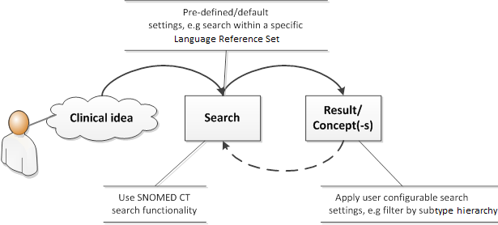

# Introduction to Search

Search is the process by which a user finds a Concept or Description to represent a clinical idea for a specific purpose.

The way a search is carried out depends on the setting in which it is performed. A simple search may involve typing a word or phrase in a search box, getting a list of matching terms and viewing the list to identify the appropriate Concept. This Guide considers a range of enhancements to SNOMED CT searches which can make it quicker and easier for users to find the appropriate Concept.

<figure><figcaption>
Search process
</figcaption></figure>

<a href="https://docs.google.com/forms/d/e/1FAIpQLScTmbZIf0UEQwYDkY27EEWBkaiYkHSbR0_9DmFrMLXoQLyL7Q/viewform?usp=pp_url&entry.1767247133=Search+And+Data+Entry+Guide&entry.670899847=Introduction%20to%20Search" class="button primary">Provide Feedback</a>
