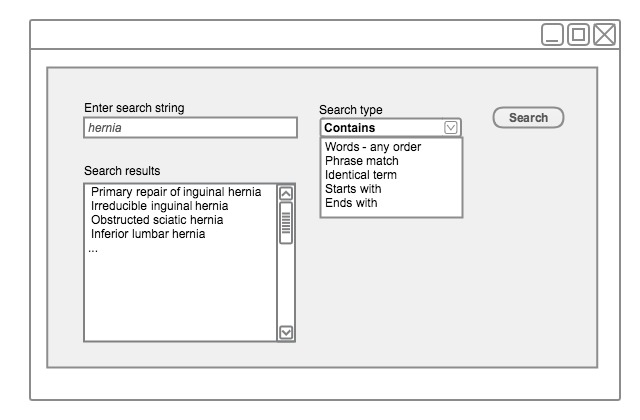

# 4.1.3. Search for Descriptions that Contain the Search Text

This technique may be used in scenarios where a user needs to find the required text anywhere in the term string including in the middle of words. However, this technique may take a lot of processing power, which could potentially impact search performance or the overall system performance. A large number of results may be returned which contain non-useful fragments (e.g. 'ete'). On the other hand, using this technique may be useful in languages that use contractions, such as German and Dutch, and there may be scenarios where the user may want to extensively search for the required text anywhere in the term string including in the middle of words such as medical pseudo-Latin & Greek terms (e.g.'gastroduodenostomy'). It is therefore useful to have this option user configurable and not have it configured as a default option. 

<figure><figcaption>
Figure 4.1.3-1: Searching for descriptions that contain "hernia"
</figcaption></figure>

