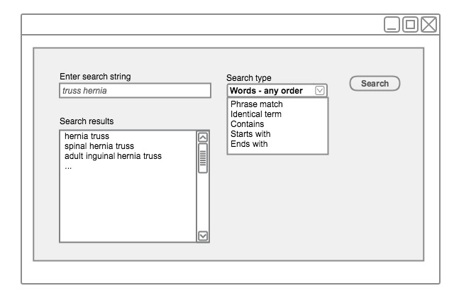

# 4.1.5. Search for Words within in Any Order

This technique enables the user to find descriptions that contain the search text string(s), whether these are at the beginning, at the end or in the middle of a description. This search type would be useful for users who do not know how words are ordered in the descriptions. It may be useful to have this option user configurable and not have it configured as a default option. 

<figure><figcaption>
Figure 4.1.5-1: Searching for words in any order
</figcaption></figure>

