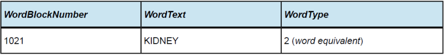

# 4.3.1. Extend Search by Word Equivalents

In healthcare, there are many words with equivalent meanings. Synonyms provide alternative phrases referring to the Concept. However, Synonyms are not created automatically for every possible combination of words with an equivalent meaning. The success of simple searches using one or more keywords depends on the text of the available Descriptions. Therefore searches will fail or will be incomplete where a different but equivalent word is used in the search. 

SNOMED CT cannot and does not attempt to enumerate all possible _synonyms_ for all Concepts. Neither to enumerate all possible semantically equivalent typographic, part-of-speech or ordering variations of the synonyms it does include. To do so, especially automatically, would both require a considerable lexical resource and hugely increase the number of Descriptions and the size of any associated index tables. An alternative technical architecture involves a selective, logical expansion of search expressions and the relevant fragment of Description-space at run-time, using substantially the same lexical resources 

For example: | Kidney stone | and | Renal calculus | are synonymous Descriptions in SNOMED CT. However, a search of SNOMED CT for the target phrase "kidney stone fragmentation" yields the result | Percutaneous nephrostomy with fragmentation of kidney stone | while a search for "Renal stone fragmentation" yields no results. One way of addressing this problem is to maintain a table of _word equivalents, and_ a table of this type is a prerequisite for exhaustive synonym generation. The Word Equivalent Table can be found in the Lexical Resources folder, which is available from the [Technical Resources](https://confluence.ihtsdotools.org/display/DOC/Technical+Resources) in the [Document Library](http://snomed.org/doc). Individual implementers will wish to add additional _word equivalents_ to meet the requirements of their particular medical specialty or user needs. The resulting table then acts as an additional resource to assist searching and parsing of phrases. It need not be a comprehensive dictionary of words. 

## Example:

"Tap" and "aspiration" are equivalent in the context of _terms_ such as "pleural tap", "pleural aspiration", but not in the context of a "patella tap", a physical "tap" on a bag or catheter, or the clinical disorder "neonatal aspiration syndrome". 

When searching using incomplete words and/or wildcards, use of _word equivalents_ may impede effective searches by increasing the number of spurious potential matches. This either extends the processing required to filter the real matches from the potential matches or increases the length of the list of choices presented to the user. 

## Example: Using word equivalents table to extend a failed search

A system user enters the search string "Fragmentation of renal calculus;" the search returns no results. The search application that the user has been provided with has the option to extend the search by using the word equivalents table (see &lt;span style=&quot;color:red;&quot;&gt;Error: Referenced caption id not found!&lt;/span&gt;&lt;div class=&quot;macroHelp&quot;&gt;&lt;b&gt;Captions on current page:&lt;/b&gt;&lt;br/&gt; - Table: with ID: &lt;b&gt;word-equivalents-table-example&lt;/b&gt; &lt;br/&gt; - Figure: with ID: &amp;lt;b&amp;gt;extending-searches-with-word-equivalents-step-1&amp;lt;/b&amp;gt; &amp;lt;br/&amp;gt; - Figure: with ID: &lt;b&gt;extending-searches-with-word-equivalents-step-2&lt;/b&gt; &lt;br/&gt; ) 

Table 4.3.1-1: Word Equivalents Table Example

<figure></figure>

<figure></figure>

<figure><figcaption>
Figure 4.3.1-1: Extending searches with word equivalents - step 1
</figcaption></figure>

  

The user selects this option (or it is invoked automatically because the initial search without word equivalents found nothing) and searches again using the same search _string_. The table is used to make substitutions in the search _string_ to produce all possible unique search variants: 

  * "Fragmentation of renal calculus"
  * "Fragmentation of renal stone"
  * "Fragmentation of kidney stone"
  * "Fragmentation of kidney calculus"
  * "Fragmentation of Nephrolith"
  * "Fragmentation of renal calculus"
  * "Fragmentation of renal calculi"
  * "Fragmentation of kidney calculi"

These 8 search variants are used as the target phrases for the searches. The search results of these variants are combined, duplicate Concepts are eliminated and the list of search results is returned.   

<figure><figcaption>
Figure 4.3.1-2: Extending searches with word equivalents - step 2
</figcaption></figure>

For more information on the the search support tables provided by SNOMED International, please see [6.1.5 Search Support Tables](/pages/createpage.action?spaceKey=DOCTSG&title=6.1.5+Search+Support+Tables). 
