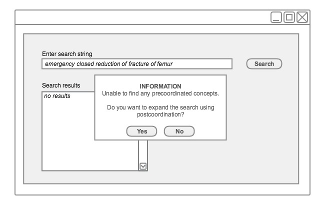
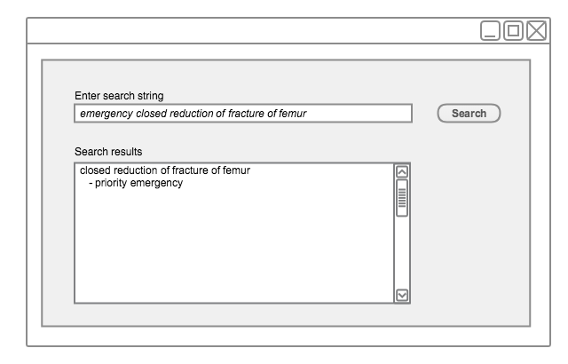

# 4.3.2. Extend Search by Postcoordinated Searching

A SNOMED CT search can be expanded to support appropriate or commonly used qualifiers. This technique is useful in situations where searches fail to find a precoordinated Concept. This is particularly useful in clinical applications which support the storage of postcoordinated expressions. This technique is likely to increase the ease of entry of postcoordinated expressions in the clinical record as well as the overall usability of search and data entry. 

As a basic implementation, a limited facility for recognizing commonly qualifying words may be used. For example, Concepts such as | left |, | right |, | routine |, and | emergency | are applicable as qualifiers for some Concepts when not already included in a precoordinated Concept. 

Example:

The phrase "emergency closed reduction fracture left femur" might list "closed reduction of fracture of femur, emergency, left" which refers to the postcoordinated expression [ 112777008 |closed reduction of fracture of femur|](http://snomed.info/id/112777008 "112777008 | closed reduction of fracture of femur |") : [ 260870009 |priority|](http://snomed.info/id/260870009 "260870009 | priority |") = [ 25876001 |emergency|](http://snomed.info/id/25876001 "25876001 | emergency |") , [ 272741003 |laterality|](http://snomed.info/id/272741003 "272741003 | laterality |") = [ 7771000 |left|](http://snomed.info/id/7771000 "7771000 | left |") .

<figure><figcaption>
Figure 4.3.2-1: Extending searches by post-coordination - step 1
</figcaption></figure>

<figure><figcaption>
Figure 4.3.2-2: Extending searches by post-coordination - step 2
</figcaption></figure>

