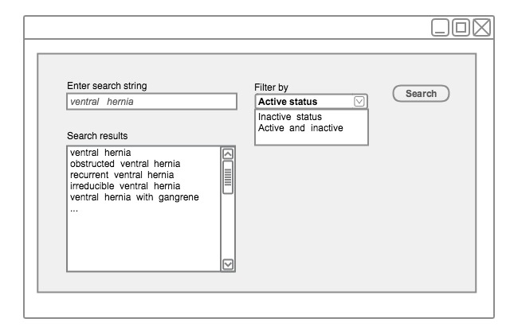

# 4.4.1. Constrain Searches by Status

Searches should usually be filtered so that only Active Descriptions associated with Active Concepts are returned.

There are a few use cases where a user may legitimately wish to search _Inactive Concepts_ and _Descriptions._ Possible cases include creating or editing queries that locate previously entered data recorded using _Concepts_ and _Descriptions_ that are no longer recommended for _active_ use. Therefore, searches intended to be used for these cases should allow the default active status filter to be disabled.

<figure><figcaption>
Figure 4.4.1-1: Constraining searches by filtering by active status
</figcaption></figure>


**Important Note**

For use cases involving data entry or design of data entry template or Reference Set, this filter should always be applied and set as active. This should not even be a filter option.

