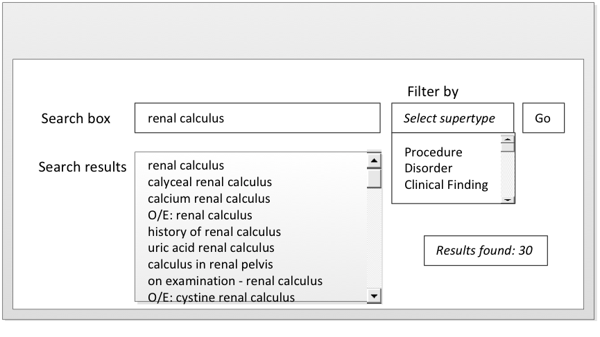

# 4.4.2. Constrain Searches by Supertype Ancestors

Searches may usefully be limited to _Concepts_ that have a specified supertype ancestor, which is appropriate for the context of a particular field, template or protocol. 

# Example

When attempting to record the diagnosis "renal calculus," it is not helpful for a search to include the procedures that may be carried out to treat a renal calculus. 

<figure></figure>

<figure><figcaption>
Figure 4.4.2-1: Constraining the search by filtering by supertype ancestors
</figcaption></figure>

