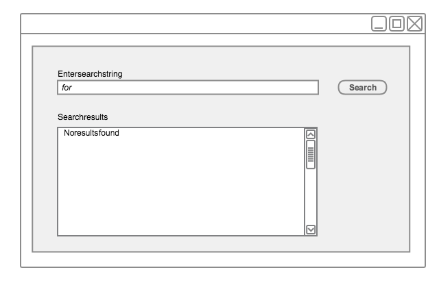

# 4.4. Constrained Searches

Constraining searches enables the search browser to return fewer candidate matches. This is opposite to extending searches (see [4.3. Extended Searches](4.3.-Extended-Searches_33490614.html)). The intention of constraining a search is to avoid getting a long list of search results to scroll through. This shortens the time the user needs to find the required Concept, thereby increasing the usability of the application. 

## Constrain searches by excluding "stop words"

Frequently used words with limited semantic specificity can be excluded from search indexes to improve the speed and specificity of searches. Examples of English words typically included in "stop word" lists include: a, an, and, as, at, be, by … of … the, etc. 

General purpose search software often includes a default list of "stop words" but these may not be entirely appropriate for SNOMED CT searches. For example, the MySQL default "Full-Text Stopwords" includes "no", "non", "not", "without" and many other words which may be highly significant when searching for clinical terms. 

The SNOMED CT International Release includes a suggested "stop list" (referred to as the _ExcludedWords_ Table). This is only available in English and is the list of exclusions used when generating keyword lists distributed with the same release. 

<figure><figcaption>
Figure 4.4-1: Constraining words in any order searches by excluding stop-words - step 1
</figcaption></figure>

<figure><figcaption>
Figure 4.4-2: Constraining words in any order searches by excluding stop-words - step 2
</figcaption></figure>

**  
**
