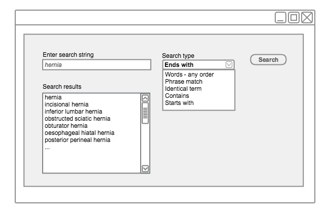

# Search by Text

This section describes different techniques that can be used when searching by text.

## Search by Text Containing Diacritic and Accented Characters

Diacritic and accented characters should be properly retrieved and displayed to ensure the completeness of a search. For instance, Sjögren must also be found by 'sjogren' and Ménière by 'meniere'). This example is specific for searches in English or in languages that do not use special characters. In countries, such as Swedish and Danish, that use special characters, it would be wrong to return "Sjögren" when searching from "Sjogren".

## Search for Description that Begin with the Search Text

This technique enables the user to find Concepts and Descriptions that begin with the text string entered in the search box. This search potentially reduces the number of keystrokes required to enter the search string. This technique is also used in scenarios where the user needs to find Concepts where they know the start of the description, but not the entire description. It is maybe, for many uses cases, a very useful technique to be configured as a pre-selected option that is user configurable.

<figure><figcaption>
Search for descriptions that start with "hernia"
</figcaption></figure>

## Search for Descriptions that Contain the Search Text

This technique may be used in scenarios where a user needs to find the required text anywhere in the term string including in the middle of words. However, this technique may take a lot of processing power, which could potentially impact search performance or the overall system performance. A large number of results may be returned which contain non-useful fragments (e.g. 'ete'). On the other hand, using this technique may be useful in languages that use contractions, such as German and Dutch, and there may be scenarios where the user may want to extensively search for the required text anywhere in the term string including in the middle of words such as medical pseudo-Latin & Greek terms (e.g.'gastroduodenostomy'). It is therefore useful to have this option user configurable and not have it configured as a default option.

<figure><figcaption>
Searching for descriptions that contain "hernia"
</figcaption></figure>

## Search for Descriptions that End with the Search Text

This technique enables the user to find Concept and Descriptions that end with word ending(s) entered in the search box. This is not considered to be a very useful technique for many use cases, nevertheless, there may be scenarios where the user may want to search for the required text at the end of words. E.g. drugs ending in "statin" – finds Atorvastatin, Cerivastatin, Fluvastatin. It may be useful to have this option user configurable and configured as a default option.

<figure><figcaption>
Searching for descriptions that end with "hernia"
</figcaption></figure>

## Search for Words within Any Order

This technique enables the user to find descriptions that contain the search text string(s), whether these are at the beginning, at the end or in the middle of a description. This search type would be useful for users who do not know how words are ordered in the descriptions. It may be useful to have this option user configurable and not have it configured as a default option.

<figure><figcaption>
Searching for words in any order
</figcaption></figure>

## Search for Identical Terms

This technique enables exact matches to be found in the search result instantly regardless of the interposing words; otherwise, search on a single word may produce many matches. This technique should be used in scenarios where the wording of the desired description is known to the user who wants to search for and instantly select from the search candidates without having to scroll through a long list of search results. It may be useful to have this option user configurable and not have it configured as a default option as it may overly constrain the search leading to missing candidates.

<figure><figcaption>
Searching for identical terms
</figcaption></figure>

## Search for Words in a Specific Order or a Matching Phrase

This technique enables the user to find Descriptions that matches all words in the search text. This means that the order of terms in the Concept or Description should be in the exact same order as the terms fully or partially represented in the search text. It may be useful to have this option user configurable and not have it configured as a default option.

<figure><figcaption>
Searching for words in order or a matching phrase
</figcaption></figure>

<a href="https://docs.google.com/forms/d/e/1FAIpQLScTmbZIf0UEQwYDkY27EEWBkaiYkHSbR0_9DmFrMLXoQLyL7Q/viewform?usp=pp_url&entry.1767247133=Search+And+Data+Entry+Guide&entry.670899847=Search%20by%20Text" class="button primary">Provide Feedback</a>
