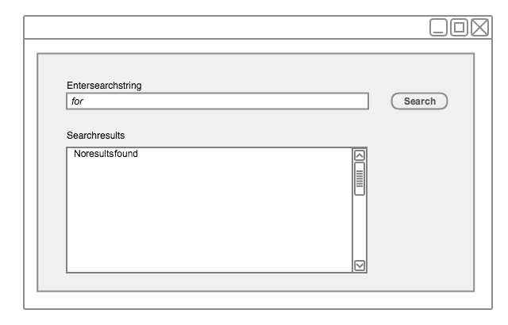
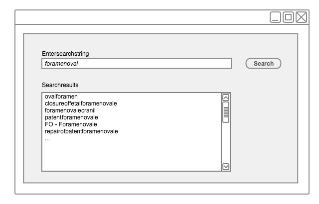
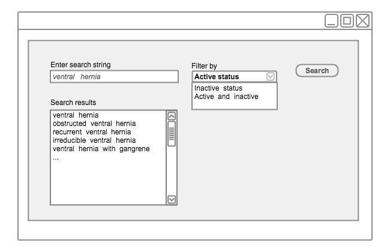

# Constrained Searches

Constraining searches enables the search browser to return fewer candidate matches. This is opposite to extending searches (see [**Extended Searches**](4.3-extended-searches.md)). The intention of constraining a search is to avoid getting a long list of search results to scroll through. This shortens the time the user needs to find the required Concept, thereby increasing the usability of the application.

## Constrain searches by excluding "stop words"

Frequently used words with limited semantic specificity can be excluded from search indexes to improve the speed and specificity of searches. Examples of English words typically included in "stop word" lists include: a, an, and, as, at, be, by … of … the, etc.

General purpose search software often includes a default list of "stop words" but these may not be entirely appropriate for SNOMED CT searches. For example, the MySQL default "Full-Text Stopwords" includes "no", "non", "not", "without" and many other words which may be highly significant when searching for clinical terms.

The SNOMED CT International Release includes a suggested "stop list" (referred to as the _ExcludedWords_ Table). This is only available in English and is the list of exclusions used when generating keyword lists distributed with the same release.

<figure><figcaption>
Figure 4.4-1: Constraining words in any order searches by excluding stop-words - step 1
</figcaption></figure>

<figure><figcaption>
Figure 4.4-2: Constraining words in any order searches by excluding stop-words - step 2
</figcaption></figure>

## Constrain Searches by Status

Searches should usually be filtered so that only Active Descriptions associated with Active Concepts are returned.

There are a few use cases where a user may legitimately wish to search _Inactive Concepts_ and _Descriptions._ Possible cases include creating or editing queries that locate previously entered data recorded using _Concepts_ and _Descriptions_ that are no longer recommended for _active_ use. Therefore, searches intended to be used for these cases should allow the default active status filter to be disabled.

<figure><figcaption>
Figure 4.4.1-1: Constraining searches by filtering by active status
</figcaption></figure>


**Important Note**

For use cases involving data entry or design of data entry template or Reference Set, this filter should always be applied and set as active. This should not even be a filter option.


## Constrain Searches by Supertype Ancestors

Searches may usefully be limited to _Concepts_ that have a specified supertype ancestor, which is appropriate for the context of a particular field, template or protocol.

### Example

When attempting to record the diagnosis "renal calculus," it is not helpful for a search to include the procedures that may be carried out to treat a renal calculus.

<figure><figcaption></figcaption></figure>

<figure><figcaption>
Figure 4.4.2-1: Constraining the search by filtering by supertype ancestors
</figcaption></figure>

## Constrain Searches by Reference Sets

Searches for Descriptions or Concepts may need to be constrained by Reference Sets. Applications should allow searches to be filtered, ordered or otherwise prioritized in accord with one or more active Reference Sets. Specifically, the search mechanism should support the following functions with respect to the following types of Reference Sets:

* A Simple Reference Set may be used to filter, sort or highlight the results of text search or hierarchical navigation. This may simplify or encourage selection of Concepts or Descriptions used in a particular country, organization or specialty.
* A Simple Reference Set or an Ordered Reference Set may be used to specify or order the valid Concepts for entry in a particular field.

Reference Set may also be used to exclude subsets of Concepts and Descriptions that are not relevant or appropriate in browsers and in-built search functionalities. For example, it may be beneficial for the search not to return any members of the non-human Reference Set, unless the search is explicitly customized to include them.

## Constrain Searches by Language or Dialect

Constraining searches by language or dialect is a type of constraining by Reference Sets. For every translated version of SNOMED CT, this technique is mandatory. Filtering of search and navigation results to include only those Descriptions that are referenced by the Language Reference Sets may be applied to limit a search to those Descriptions applicable in a particular language or dialect. A single common encoding language should be mandatory in search use cases directly connected to data entry, to avoid confusion and ambiguity. There are a few use cases where a user may legitimately wish to search for Descriptions included in extensions of other countries _._ For example, when mapping SNOMED CT to other code sets, en-US (American) Descriptions may be required if extensions are not available in the UK language Reference Set.
