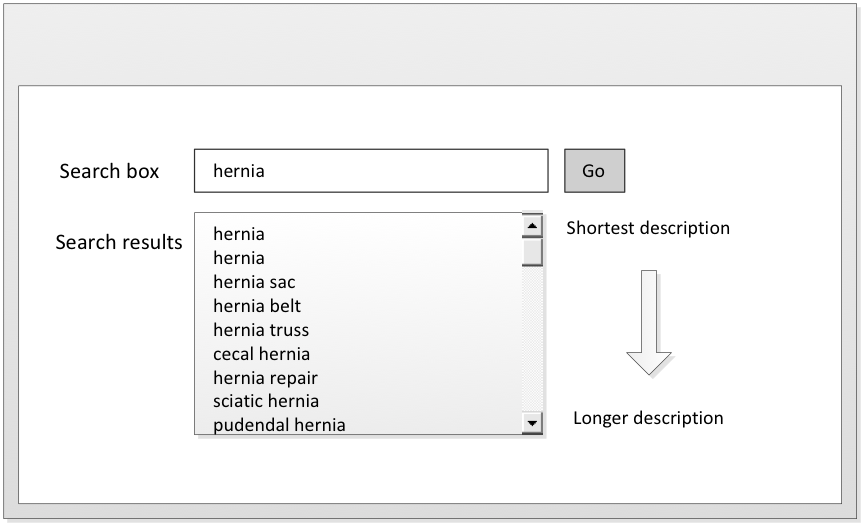

# 5.1.1. Order Shortest Matching Terms First

  

Ordering the shortest matching term first is a common display requirement for search browsers and search functionalities in clinical applications. This applies text search techniques previously in the Guide (e.g. searching for descriptions that contain the search text). [see 4.1.1 Search by text] Many users can expect this technique to exist in all use cases concerning searches that return large result sets. It is intuitive to display the shortest term that is also the closest lexical match first. If the shortest matching term is not in the first set of visible matches, a user is likely to assume that there are no relevant candidate matches or use the wrong concept or description. 

<figure><figcaption>
Figure 5.1.1-1: Ordering shortest matching terms first
</figcaption></figure>

  

  
A common mistake is to implement a search functionality that is configured to sort search results alphabetically in a clinical setting. The result list, when Concepts like hernia is searched, starts as shown below and the term "hernia" itself would be more than 130 items down a list of over 700 matches. 

Table 5.1.1-1: Position of term 'hernia' in an alphabetic and shortest terms ordered search 'hernia'

  

**Position**| **Alphabetic order of results**| **Shortest match first  
**  
---|---|---  
1| abdominal hernia| **hernia**  
2| abdominal wall hernia procedure| hernia sac  
3| airway device cuff herniation| hernia belt  
4| anesthesia for hernia repair in lower abdomen| O/E - hernia  
...| anesthesia for hernia repair in upper abdomen| cecal hernia  
6| anesthesia for lumbar or ventral incisional hernia of upper abdomen| labial hernia  
7| anesthesia for transabdominal repair of diaphragmatic hernia| hernia repair  
8| anesthesia for ventral or incisional hernia repair, lower abdomen| littré hernia  
9| anterior perineal hernia| Cooper hernia  
....|   
|   
  
**131**| **hernia**|   
  
  
  

  

  

