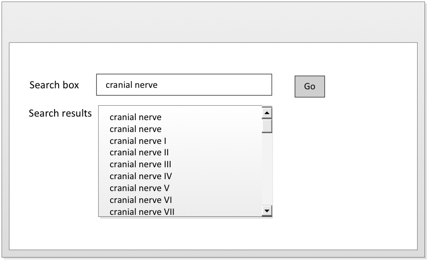

# 5.1.4. Order According to Priority in Any Active Reference Sets

Search results may need to be configured in a specified order using one or more active Ordered Reference Sets. The way in which access to search results is prioritized depends on the nature of the application and its operating environment. Examples of prioritization include: 

  * Showing Descriptions associated with high priority Concepts before those with lower priority. 
  * Showing Concepts with high priority before their less highly prioritized siblings in hierarchical display results. [see 5.5.3 Using the navigation hierarchy] 
  * Initially listing Concepts and associated Descriptions with priority above a specified threshold and requiring additional step to access those assigned lower priority. 

<figure><figcaption>
Figure 5.1.4-1: Unordered search results for cranial nerve
</figcaption></figure>

  

<figure><figcaption>
Figure 5.1.4-2: Ordering search results for cranial nerve using and ordered component reference set
</figcaption></figure>

