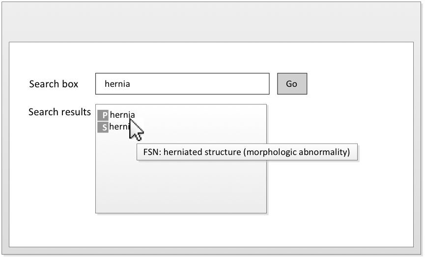

# 5.2. Distinguish Identical Terms of Different Concepts

A search for a term (e.g. "fundus") may return multiple identical matches. Fully specified name Descriptions are always unique at a specific release. However, the preferred terms or synonyms may not always be unique, as illustrated in **Figure 5.2-1.**

<figure><figcaption>
Figure 5.2-1: Hovering over identical terms of different Concepts
</figcaption></figure>

Identical terms of different Concepts can be distinguished by displaying the search results under different headings according to which supertype ancestors they belong to. This technique is particularly useful for searching large unconstrained subsets that belong to more than one supertype ancestors.

<figure><figcaption>
Figure 5.2-2: Categorizing search results under subtype hierarchies
</figcaption></figure>
