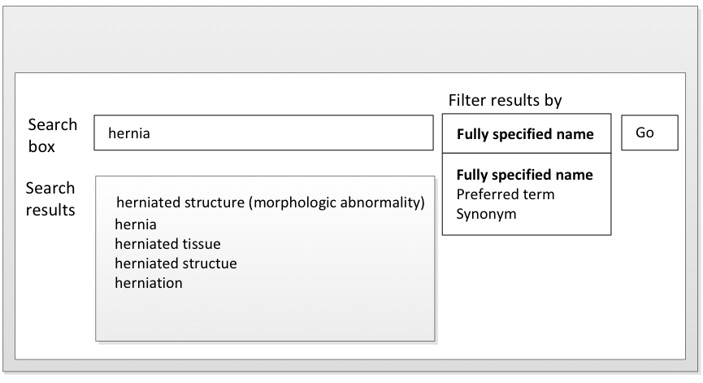
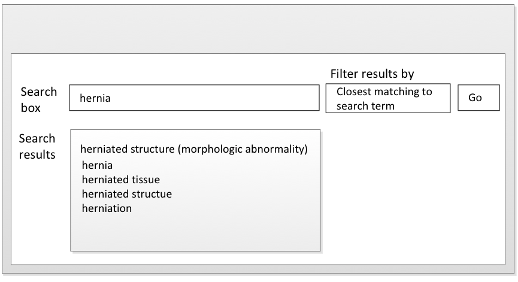

# 5.3. Avoid Multiple Hits on the Same Concept

In many instances, several synonyms associated with the same Concept contain the same keyword _._ For example, | herniated structure |, | hernia |, | herniated tissue |, | herniated structure | and | herniation | all begin with "hernia". A search for the target Concept "hernia" would return the first phrase found during the search. Designing a filter that gives the user the option of filtering the results by description type such as the Preferred Term or the Fully Specified Name can significantly reduce the results, as illustrated in [Figure 5.3-1](https://confluence.ihtsdotools.org/display/DOCSEARCH/5.3.+Avoid+Multiple+Hits+on+the+Same+Concept#Figure-only-show-fsn "Filtering search results to show only the Fully Specified Name \(search also constrained by supertype ancestor\)"). 

# Avoid Multiple Hits on the Same Concept by Filtering the Search by Description Type

Step 1| Step 2  
---|---  

<figure><figcaption>
Figure 5.3-1: Filtering search results to show only the Fully Specified Name (search also constrained by supertype ancestor)
</figcaption></figure>| __IMAGE_PLACEHOLDER_2__  
  
  

Designing a filter gives the user the option of filtering the results to show only the Description associated with the Concept that is the closest match to the search term, as illustrated in [Figure 5.3-2](https://confluence.ihtsdotools.org/display/DOCSEARCH/5.3.+Avoid+Multiple+Hits+on+the+Same+Concept#Figure-only-closest-match "Filtering search results to show only the closest match to the search term, hernia \(search also constrained by supertype ancestor\)")

Step 1| Step 2  
---|---  

<figure><figcaption>
Figure 5.3-2: Filtering search results to show only the closest match to the search term, hernia (search also constrained by supertype ancestor)
</figcaption></figure>| __IMAGE_PLACEHOLDER_4__  
  
  

