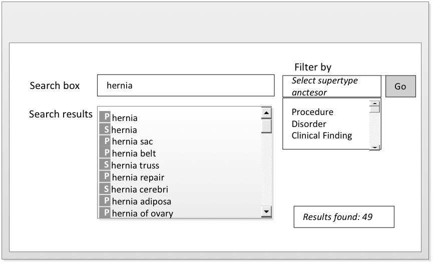
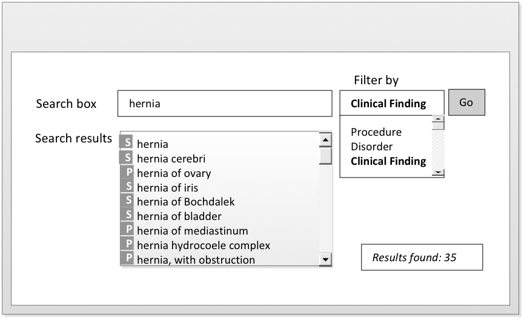
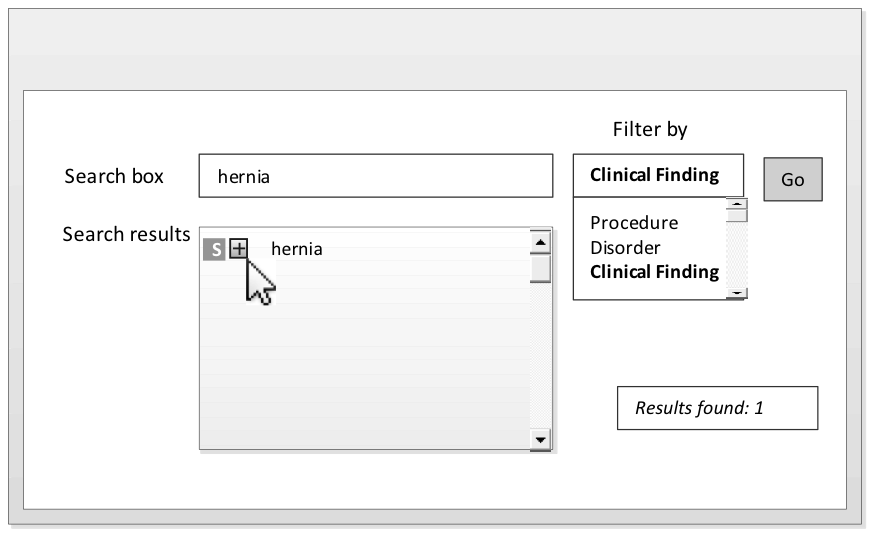

# Rationalize Search Results by Subsumption Checking

Filtering a search by using subsumption checking is an effective technique to enhance the display of search results. It reduces the list of search results by nesting the subsumed Concepts under the general Concept. If the user wishes to select a narrower Concept, they can expand the node to select the nested subtype.

## An Example Illustrating Rationalization by Subsumption Cross-Checking

Unconstrained search for descriptions that begin with "hernia" returns a total of 49 Concepts which belong to many subtype hierarchies such as <mark style="color:blue;">|</mark> Clinical Finding <mark style="color:blue;">|</mark> and <mark style="color:blue;">|</mark> Morphologic abnormalities <mark style="color:blue;">|</mark>.

<figure><figcaption>
Figure 5.4-1: Rationalize search results by subsumption checking
</figcaption></figure>

Constraining a search for "hernia" by the "clinical findings" supertype returns 35 matches which is still considered to be a long list, many of which are subsumed by the general Concept "hernia". \[see [Constrain searches by supertype ancestors](<../4 optimizing-searches/4.4 constrained-searches/4.4.2-constrain-searches-by-supertype-ancestors.md>)]

<figure><figcaption>
Figure 5.4-2: Rationalize search results by subsumption checking - clinical findings only
</figcaption></figure>

Rationalisation by subsumption cross-checking can further reduce the matches by nesting the subsumed Concepts such as <mark style="color:blue;">|</mark> perineal hernia <mark style="color:blue;">|</mark> under <mark style="color:blue;">|</mark> hernia <mark style="color:blue;">|</mark>. If the user wishes to select a narrower Concept, they can expand the node to select the nested subtype.

<figure><figcaption>
Figure 5.4-3: Subsumed Concepts nested under "hernia"
</figcaption></figure>
