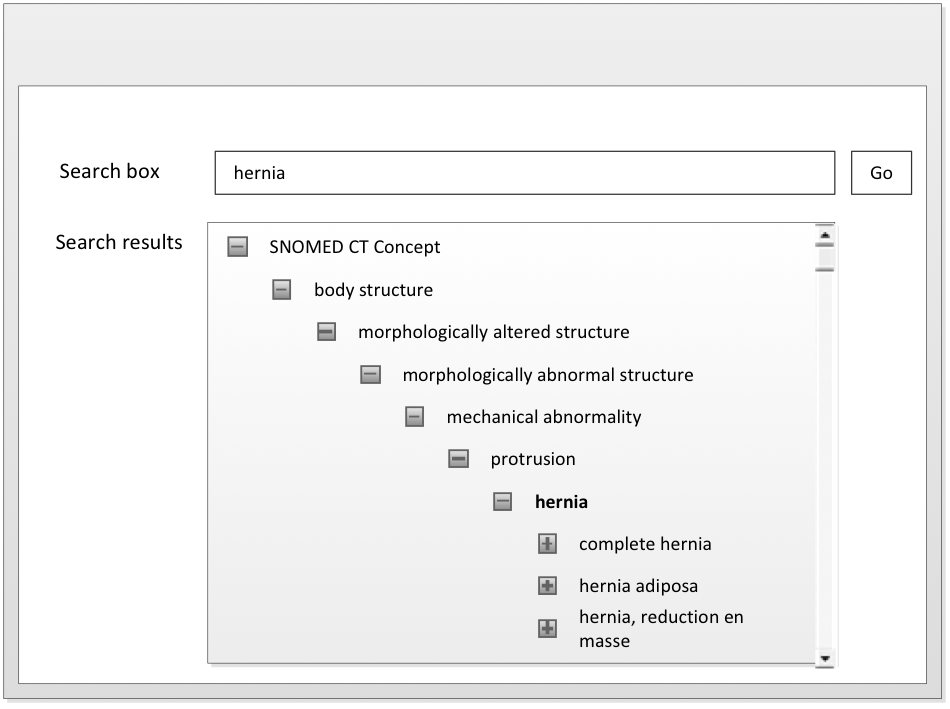

# Using the Subtype Hierarchy

The most visible hierarchical construct in SNOMED CT is the subtype hierarchy. This is constructed using a set of logical rules.

<figure><figcaption>
Matches shown in the subtype hierarchy
</figcaption></figure>

The primary use of the SNOMED CT subtype hierarchy is to support effective retrieval and aggregation of data.

### Example:

The Concept "Laparoscopic emergency appendectomy" can be reliably located by subtype navigation from any of its supertypes: "appendectomy," "laparoscopic appendectomy" or "emergency appendectomy."

## Enhanced Hierarchical Displays

It is possible to start at the top of hierarchy and navigate from parent to child in order to find a Concept or term in SNOMED CT. A more efficient approach, however, is to use the hierarchy to supplement a keyword search by enabling the user to look at related Concepts in order to consider them as alternative matches, or to check the context of a search result. The following examples illustrate these two uses of the SNOMED CT hierarchy.

### Examples:

#### 1. Checking supertypes:

A user wishes to find a _Description_ that relates to the condition of a patient who is hypersensitive to an allergen. The user performs a search on the _keyword_ "Hypersensitivity" and finds an exact match. Before the user selects the _Description_ for inclusion in the patient record, they check the _Fully Specified Name_ , which is | Sensitivity (finding) |. The user then checks the _hierarchy_ and discovers that the selected _Concept_ has | Psychological finding | as an _ancestor_ , which indicates that this is not the correct _Description_ to use in this context.

#### 2. Checking subtypes:

A user wishes to find a _Description_ that relates to the condition of a patient who is hypersensitive to an allergen. The user searches for the _keyword_ "allergy," and finds one _Concept_ having a _Description_ that is an exact match. The user then looks at the _children_ of the _Concept_ (i.e. those _Concepts_ immediately below it in the _hierarchy_). One of the _children_ has the preferred _Description_ | Contact Hypersensitivity | which matches the user's intended meaning. The user selects this _Concept_ for inclusion in the patient record.

## The Challenge of Subtype Navigation

The same hierarchy can be used for data entry navigation following search but it is not designed for this purpose. Its depth and breadth are determined by logical rules of subsumption rather than by usability. As a result: There is no upper limit on the number of subtypes a Concept may have. This is true because there is no rule that determines the number of subtypes that a real world Concept may have. However, long lists of options are not conducive to effective data entry.

There is no fixed limit to the number of hierarchical steps between a generalized Concept and its most refined subtype. This is true since there is no preordained limit on the extent of possible refinement of a real world Concept. However, data entry procedures that involve stepping through several levels of choices before reaching the required selection impair usability.

The subtypes of a Concept do not have any particular order. The <mark style="color:blue;">|</mark> is a <mark style="color:blue;">|</mark> Relationship is primarily a property of the subtype Concept and does not express an ordinal position. This is true because logical subtypes are inherently an unordered set. However, a user is likely to find it easier to locate their required selection if members of hierarchical lists are displayed in some recognizable order.

The issues of depth, length and order noted above are also subject to change between releases. The addition of an intermediate Concept or reclassification after the addition of new defining characteristics will introduce new layers in the hierarchy. Some Concepts will then move from the list of immediate subtypes of a Concept to become subtypes of a more refined Concept. Hierarchical changes may sometimes simplify navigation by reducing the number of choices at a given hierarchical level. However, the general effect of improvements in the subtype hierarchy will be to increase its depth and thus to increase the number of steps from a particular general Concept to its most refined subtypes.

The poly-hierarchical structure allowing for a concept to have more than a single parent concept means that there may be many routes from a given Concept to its more general ancestors. This means that some of the choices presented for user selection are redundant since they simply offer alternative routes to the same Concept.

Routine use of subtype hierarchy navigation is not recommended for data entry. However, despite the drawbacks listed above, the subtype hierarchy may be useful for undertaking an exhaustive search for a particular refined Concept.
