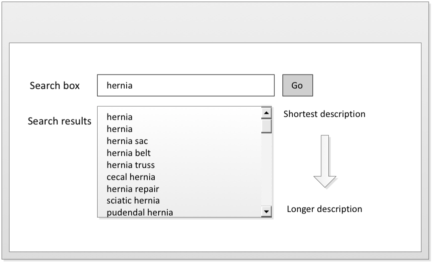
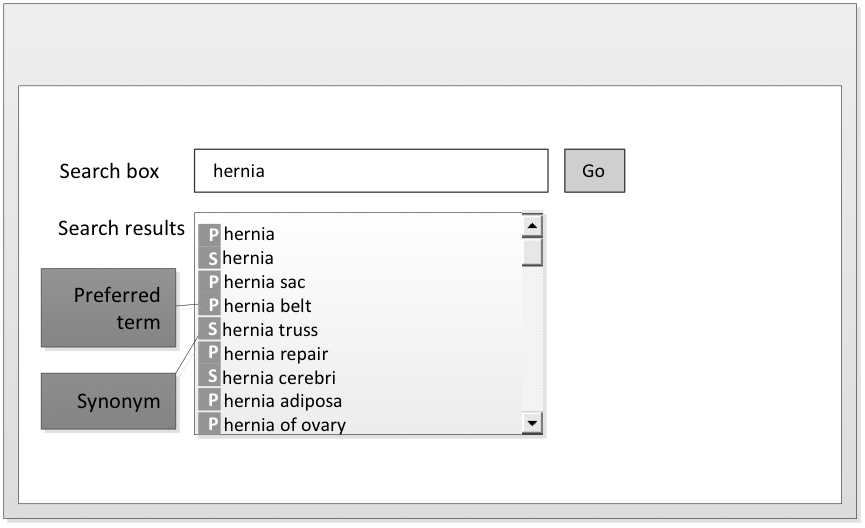
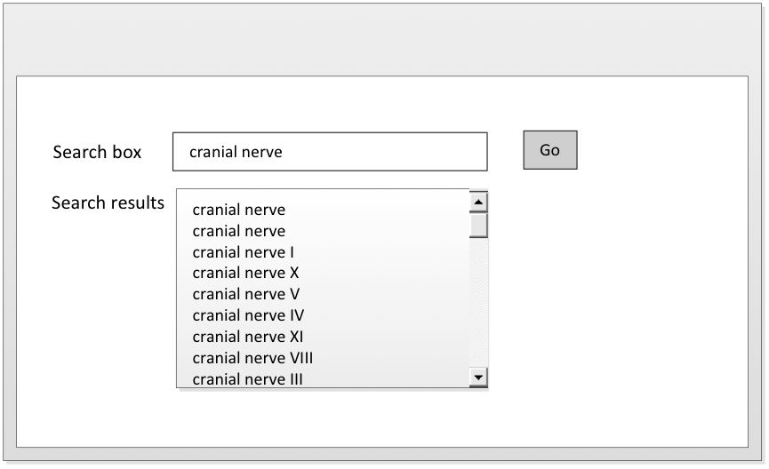
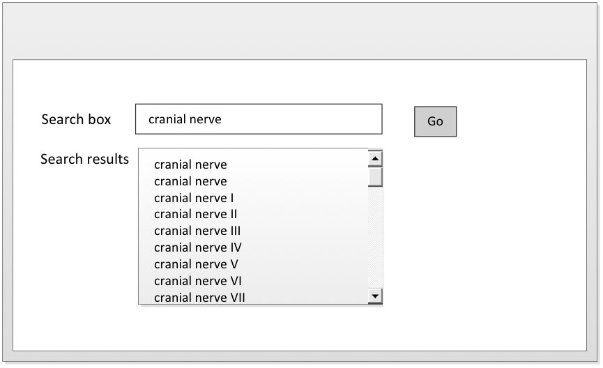
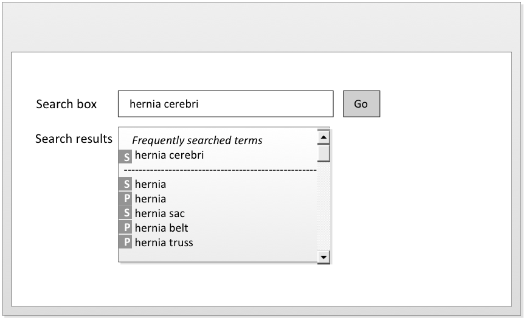

# Order Search Results Rationally

This section concerns the rational ordering of search results. When developing browsers and search embedded functionality within clinical applications, careful consideration must be taken in specifying the prioritization of search results, as adopting many of the recommended techniques below may compromise the speed of search.

## Order Shortest Matching Terms First

Ordering the shortest matching term first is a common display requirement for search browsers and search functionalities in clinical applications. This applies text search techniques previously in the Guide (e.g. searching for descriptions that contain the search text). \[see [Search by text](../4-optimizing-searches/4.1-search-by-text.md)] Many users can expect this technique to exist in all use cases concerning searches that return large result sets. It is intuitive to display the shortest term that is also the closest lexical match first. If the shortest matching term is not in the first set of visible matches, a user is likely to assume that there are no relevant candidate matches or use the wrong concept or description.

<figure><figcaption>
Figure 5.1.1-1: Ordering shortest matching terms first
</figcaption></figure>

A common mistake is to implement a search functionality that is configured to sort search results alphabetically in a clinical setting. The result list, when Concepts like hernia is searched, starts as shown below and the term "hernia" itself would be more than 130 items down a list of over 700 matches.

Table 5.1.1-1: Position of term 'hernia' in an alphabetic and shortest terms ordered search 'hernia'

<table><thead><tr><th width="100.87109375">Position</th><th width="489.19921875">Alphabetic order of results</th><th width="199.625">Shortest match first</th></tr></thead><tbody><tr><td>1</td><td>abdominal hernia</td><td><mark style="background-color:green;"><strong>hernia</strong></mark></td></tr><tr><td>2</td><td>abdominal wall hernia procedure</td><td>hernia sac</td></tr><tr><td>3</td><td>airway device cuff herniation</td><td>hernia belt</td></tr><tr><td>4</td><td>anesthesia for hernia repair in lower abdomen</td><td>O/E - hernia</td></tr><tr><td>...</td><td>anesthesia for hernia repair in upper abdomen</td><td>cecal hernia</td></tr><tr><td>6</td><td>anesthesia for lumbar or ventral incisional hernia of upper abdomen</td><td>labial hernia</td></tr><tr><td>7</td><td>anesthesia for transabdominal repair of diaphragmatic hernia</td><td>hernia repair</td></tr><tr><td>8</td><td>anesthesia for ventral or incisional hernia repair, lower abdomen</td><td>littré hernia</td></tr><tr><td>9</td><td>anterior perineal hernia</td><td>Cooper hernia</td></tr><tr><td>....</td><td></td><td></td></tr><tr><td><strong>131</strong></td><td><mark style="background-color:red;"><strong>hernia</strong></mark></td><td></td></tr></tbody></table>


**Caution**

Alphabetic searches can compromise patient safety as the best matching term is not easily found. However, even searches for the shortest term need to be constrained to concept types relevant to the clinical setting to ensure only relevant matches are shown.


## Order Preferred Term Matches Before Synonyms

It is recommended to order preferred term matches before synonyms, particularly in clinical settings, as the _Preferred Term_ is a common word or phrase used by clinicians to name that _Concept_. This technique will enhance usability and significantly increase the speed of data entry. It may be helpful to the user whether the candidate match is a Preferred Term or synonym.

<figure><figcaption>
Figure 5.1.2-1: Ordering preferred term matches before synonyms
</figcaption></figure>

## Order User Preferred Term Language Matches First in Multilingual Environments

For a country or region that has more than one official language (e.g. Belgium), it would be useful to have a user configurable option that enables results to display matches in a preferred language first in applications that support more than one language. This can be done using combinations of Language Reference Sets.

## Order According to Priority in Any Active Reference Sets

Search results may need to be configured in a specified order using one or more active Ordered Reference Sets. The way in which access to search results is prioritized depends on the nature of the application and its operating environment. Examples of prioritization include:

* Showing Descriptions associated with high priority Concepts before those with lower priority.
* Showing Concepts with high priority before their less highly prioritized siblings in hierarchical display results. \[see [Using the navigation hierarchy](<../5 optimize-display-of-search-results/5.5 display-navigation-results-effectively/5.5.3-using-the-navigation-hierarchy.md>)]
* Initially listing Concepts and associated Descriptions with priority above a specified threshold and requiring additional step to access those assigned lower priority.

<figure><figcaption>
Figure 5.1.4-1: Unordered search results for cranial nerve
</figcaption></figure>

<figure><figcaption>
Figure 5.1.4-2: Ordering search results for cranial nerve using and ordered component reference set
</figcaption></figure>

## Display the Most Frequently Used Descriptions Listed First

This option will require the application to track the frequency of term selection so that search results can show the most frequently selected terms near the top of the results or displayed separately in the results. If this technique is chosen, user guidance may be necessary to minimize the risk of overusing the frequently used Descriptions as they would be easier to find. An alternative way of browsing through frequently used terms is to give the user the option to store the frequently selected terms as personal favorites and recall with user-defined abbreviated access term following a search. \[see [Use Mnemonics and personal favorites for data entry](<../5 optimize-display-of-search-results/5.6-use-mnemonics-and-personal-favorites-for-data-entry.md>)]

<figure><figcaption>
Figure 5.1.5-1: Displaying most frequently used Description after this Description was entered in previous search
</figcaption></figure>

## Alphabetical Ordering

As noted in the [Order Shortest Matching Terms First ](5.1-order-search-results-rationally.md#order-shortest-matching-terms-first)section, alphabetical ordering of search results should **NOT** be used for general purpose searches of SNOMED CT. Instead the shortest matches, best matches or most commonly used matches should be shown first. However, there may be some specific situations in which it may be useful to alphabetically order a short list of matches. For example short pick-lists may be alphabetically ordered in a data entry form. \[see [Examples of applied mechanisms of structured data entry](../6-data-entry/6.2-structured-data-entry.md#examples-of-applied-mechanisms-of-structured-data-entry)]
