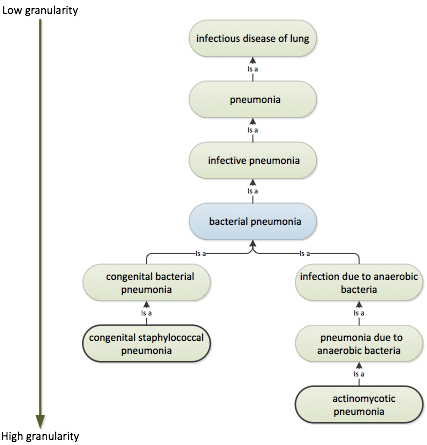

# 6.1.1. Specificity and Generalization

SNOMED CT hierarchies are subtype hierarchies (made up of 'is a' relationships) that allow for clinical information to be entered at a level of detail sufficient for the specific clinical situation or possible at the given point in time. 

For example, it is possible to specify a clinical finding at very high level of detail, which is relevant and important for clinical treatment. The 'is a' relationships allow for SNOMED CT hierarchies to be automatically traversed, and to enable terminological reasoning of common sub- and supertypes. This means that Concepts can be automatically aggregated into more general types, which is useful for management purposes and for statistics. 

**Example:**

Traversing the supertype hierarchies of the two concepts | actinomycotic pneumonia | and | congenital bacterial pneumonia | will show that both Concepts are types of | bacterial pneumonia |. 

<figure><figcaption>
Figure 6.1.1-1: The subtype hierarchies link specific detailed concepts to general concept with less granularity
</figcaption></figure>

  

