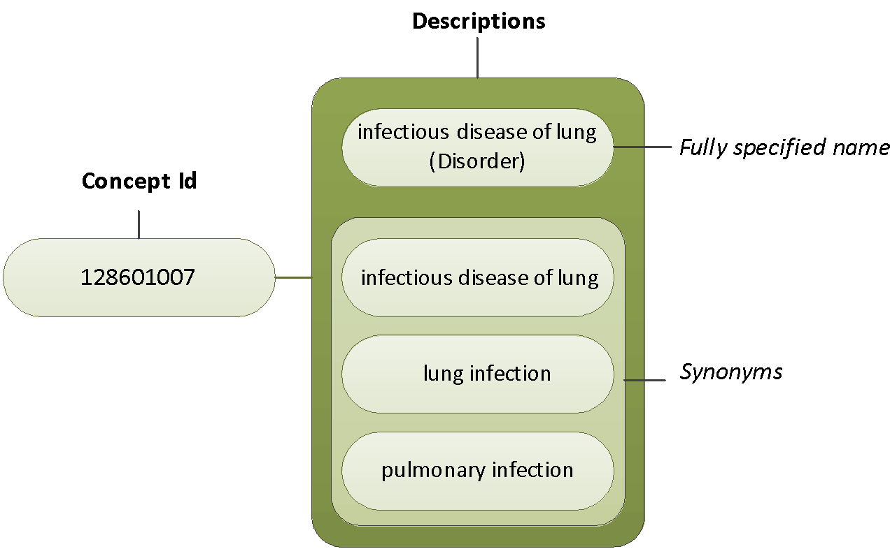

# 6.1.2. Clinical Language and Coding

The unique Concept identifiers of SNOMED CT Concepts are numeric identifiers and do not contain information related to the meaning of a Concept or Description. This means it is not possible to infer anything about the meaning of a Concept from the numeric value of the Identifier or from the sequence of digits that form the identifier. 

The meaning of a Concept can be determined from relationships to other Concepts and from associated Descriptions that include human readable terms. In the context of data entry, this means that entering SNOMED CT Concepts must be done by using associated Concept Descriptions, and hence by use of the clinical spoken language instead of using the Concept codes for data entry. 

<figure><figcaption>
Figure 6.1.2-1: SNOMED CT Descriptions support the use of clinical language for documentation and the synonyms support flexibility in the terms used to represent the Concepts
</figcaption></figure>

Additionally, SNOMED CT allows for coding different Descriptions that belong to the same Concepts. This support flexible data entry, by enabling the possible to use the Descriptions preferred in a specific organization or within a specific user group. 
