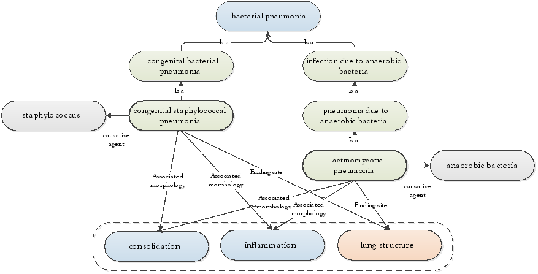

# 6.1.3. Data Entry as Foundation for Meaning-Based Retrieval

Use of SNOMED CT for data entry has implications for how clinical data can be used and retrieved. The SNOMED CT relationships support meaning-based retrieval of clinical data, which can be useful for creating specific clinical overviews or for aggregating data with specific characteristics (meaning). 

The figure below shows some of the defined relationships that are included in SNOMED CT to define the two Concepts | actinomycotic pneumonia | and | congenital bacterial pneumonia |. The Concepts have different causative agents; however the associated morphology and the finding site of the findings are equivalent. This means, that both Concepts would be part of a result of queries that retrieve clinical findings with the finding site | lung structure | and the associated morphology | inflammation | or | consolidation |. 

<figure><figcaption>
Figure 6.1.3-1: Meaning based retrieval
</figcaption></figure>

Such types of meaning-based queries are possible to develop because of the integrated clinical meaning which is made explicit by the defined relationships. Terminological reasoning therefore makes it possible to develop queries that retrieve all Concepts with a specific meaning. In many cases this approach is much more effective and efficient than manually specifying which Concepts to retrieve based on the unique Concept Id's. 
