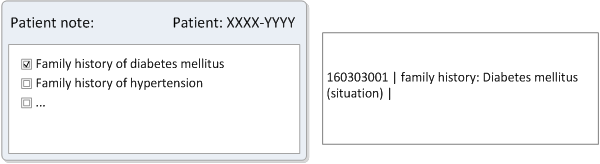
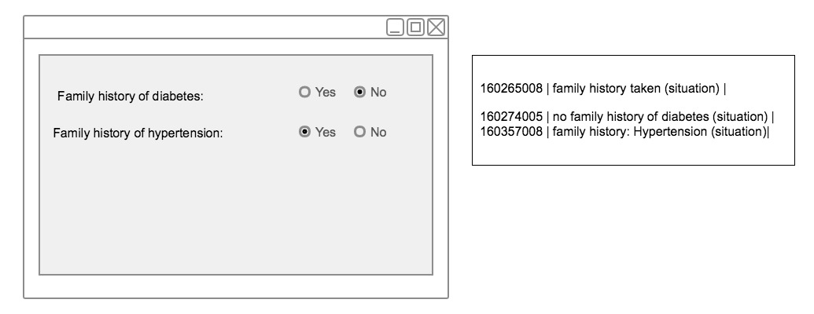

# 6.2.4. Examples of Interface Design AND Concept Selection

# Implicit and Explicit Meaning of Interface Terms

The illustrations below shows a template designed for the purpose of documenting diseases that occur in the patients familiy history. 

The first template below shows a heading that specifies the context of the template, namely documentation of 'family history', whereas the checkboxes allow for specifying the family history of the disease. The direct (lexical) map between the interface term "Diabetes Mellitus" without considering the actual context will be the clinical finding Concept | Diabetes Mellitus (Disorder) |.

<figure><figcaption>
Figure 6.2.4-1: Family history form with interface term of implicit meaning
</figcaption></figure>

However, the appropriate Concept for data entry is the situation Concept | family history : Diabetes mellitus (situation) | based on the meaning of the interface term. 

The form below shows a patient note with check boxes to enter diseases that occur in the patient's family history. Here, there is a direct (lexical) map between the interface term "family history : Diabetes mellitus" and the meaning of the interface term, | family history : Diabetes mellitus (situation) |.

<figure><figcaption>
Figure 6.2.4-2: Patient note form with interface term of explicit meaning
</figcaption></figure>

It is therefore a requirement that careful thought be given about the actual meaning of each entry when selecting Concepts to represent a data entry, regardless of the specificity (or correctness) of the interface term. 

# Entry of Presence and Absence

The example below shows another typical way of documenting occurences or negations of specific findings. The interface terms 'yes' and 'no' can be mapped to the qualifier values | yes (qualifier value) | and | no (qualifier value) |. However, these Concepts are meaningsless without knowing the finding or situation to which they relate. The appropiate mapping for these entries would therefore be expressions that specify the presence or absence of the actual finding, situation, etc. In this example the Concepts that represent respectively 'Yes' and 'No' would be the situations | no family history diabetes (situation) | and | family history: Diabetes mellitus (situation) |.

<figure><figcaption>
Figure 6.2.4-3: Entry of presence and absence
</figcaption></figure>

