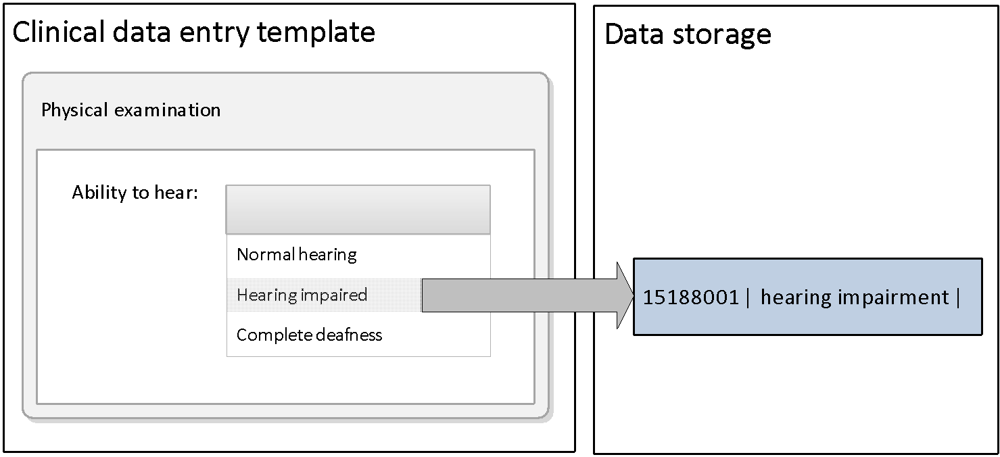
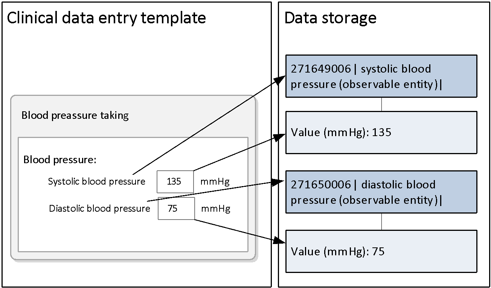
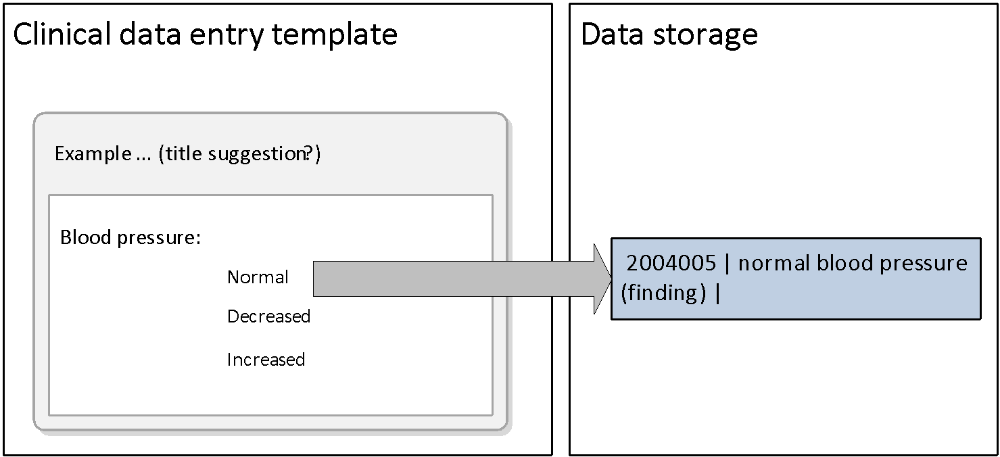
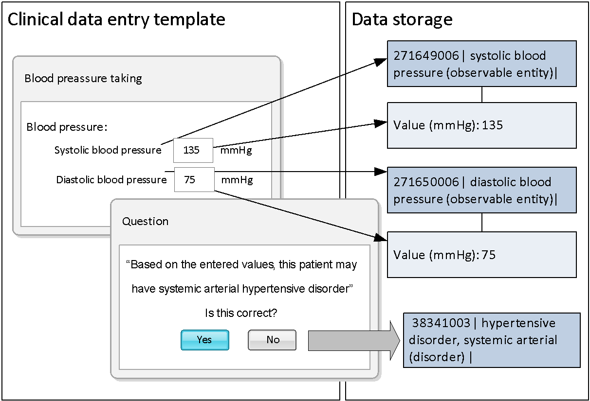
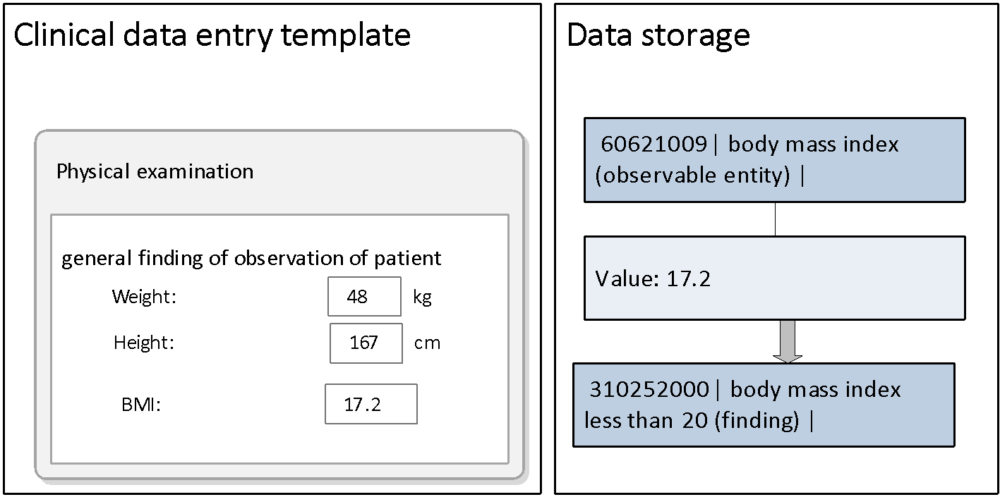

# 6.2.5. Examples of Applied Mechanisms of Structured Data Entry

# Short List of Options

User selects from a small list of possible [Descriptions](https://confluence.ihtsdotools.org/display/DOCGLOSS/Description "Glossary link: Descriptions") applicable to a particular field in a template or step in a protocol. A Simple [Reference Set](https://confluence.ihtsdotools.org/display/DOCGLOSS/Reference+Set "Glossary link: Reference Set") with corresponding [Descriptions](https://confluence.ihtsdotools.org/display/DOCGLOSS/Description "Glossary link: Descriptions") from a particular Language [Reference Set](https://confluence.ihtsdotools.org/display/DOCGLOSS/Reference+Set "Glossary link: Reference Set") may specify the set of applicable [Descriptions](https://confluence.ihtsdotools.org/display/DOCGLOSS/Description "Glossary link: Descriptions"). 

<figure><figcaption>
Figure 6.2.5-1: Data entry using a simple reference set
</figcaption></figure>

# Longer Lists Require Effective Search Techniques

<figure><figcaption>
Figure 6.2.5-2: Data entry using a large Reference set requires use of search techniques
</figcaption></figure>

See section [4\. Optimizing Searches](4.-Optimizing-Searches_33490598.html), for further information about effective search techniques. 

# Binding a Concept to a Data Control Used for Entering a Numeric or Other Value

When a value is entered in this control it is labeled with the appropriate Concept Identifier and added to the record. 

<figure><figcaption>
Figure 6.2.5-3: Data entry of numeric values
</figcaption></figure>

# Association of a Concept with Particular Options Presented by a Check Box, Option Button or Other Data Entry Control 

<figure><figcaption>
Figure 6.2.5-4: Data entry using radio buttons / check lists
</figcaption></figure>

When selections are made using this control the appropriate Concept identifier is added to the record. 

# Binding Concept to a Particular Combination of Values or the Result of a Computation Involving Several Items of Previously Entered Data 

<figure></figure>

<figure><figcaption>
Figure 6.2.5-5: Two examples of how data entry of specific values can be foundation for automatic addition of appropriate SNOMED CT clinical findings
</figcaption></figure>

When specific values are entered the appropriate (defined) Concept identifier is added to the record. The above examples show how specific numeric values can lead to specific clinical findings, based on pre-defined rules. 

The example at the bottom of Figure 39, illustrate that the BMI can be automatically calculated by the entered values for body weight and height. Moreover, it is possible to develop rule-based coding (i.e. algorithms that assign BMI values between 20 and 24 to the SNOMED CT Concept 35425004 | normal body mass index |, or to a more specific Concept 412768003 | body mass index 20-24 - normal |.

Value| Concept  
---|---  
< 20| 

  * 6497000 | decreased body mass index |
  * 427090001 | body mass index less than 16.5 |
  * 310252000 | body mass index less than 20 |

  
25 <| 

  * 48499001 | increased body mass index |
  * 162863004 | body mass index 25-29 - overweight |
  * 162864005 | body mass index 30+ - obesity |
  * 408512008 | body mass index 40+ - severely obese |

  
20 -24| 

  * 35425004 | normal body mass index |
  * 412768003 | body mass index 20-24 - normal |

