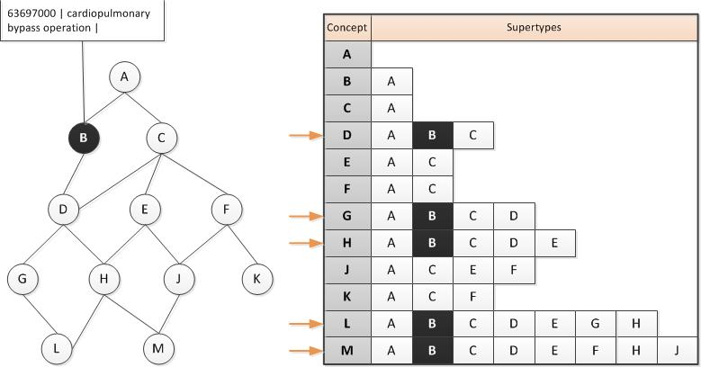

# 6.3.3. Constrain Data Entry According to Supertype Relevance

Constraining data entry according to supertype relevance is a technique that can support data entry, in which only particular sub-hierarchies that include Concepts relevant for the specific data entry point can be browsed or displayed. 

**Example :**

If a pick list in a data entry template should allow the selection, a specific "cardiopulmonary bypass operation", the SNOMED CT subtype hierarchy to specify what Concepts are to be included in the list, namely the descendants of the Concept "63697000 | cardiopulmonary bypass operation | ". Constraining data entry according to subtype relevance can be done using the transitive closure table, as shown in the figure below. The transitive closure table contains [relationships](https://confluence.ihtsdotools.org/display/DOCGLOSS/relationship "Glossary link: relationships") to all supertypes [ancestors](https://confluence.ihtsdotools.org/display/DOCGLOSS/ancestor "Glossary link: ancestors") of each defined [Concept](https://confluence.ihtsdotools.org/display/DOCGLOSS/Concept "Glossary link: Concept"). A query for the set of Concepts, where the Concept "63697000 | cardiopulmonary bypass operation | "(shown as Concept B in Figure 40) is a supertype, will produce the constrained set of Concepts relevant for creating specific pick lists. 

  

<figure><figcaption>
Figure 6.3.3-1: Using transitive closure to constrain data entry according to supertype relevance
</figcaption></figure>

Identifying selected portions of the SNOMED CT hierarchy may not be a sufficient constraint for entering data into a record. Constraining data entry through the use of Reference Sets may be more sufficient for producing the required set of Concepts relevant for data entry. [see 6.4.4 Constrain data entry using Reference Sets] 
