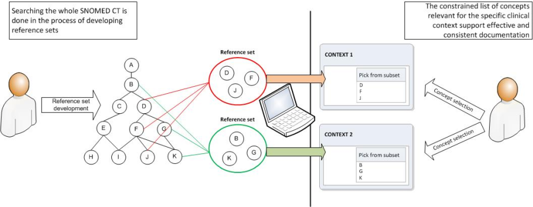

# 6.3.4. Constrain Data Entry Using Reference Sets

<figure><figcaption>
Figure 6.3.4-1: Constraining data entry using Reference Sets
</figcaption></figure>

  

  

  

In some cases, identifying selected portions of the SNOMED CT hierarchy may be a sufficient constraint for entering data into a record. However, it is not always sufficient if Concepts from multiple hierarchies are required, or if there is a need to hone the entry options from the full hierarchy. To meet these requirements applications should allow data entry to be constrained by Reference Sets. 

Applications should be able to:

  * Permit or prevent the entry of Concepts or Descriptions that are members of a specified Simple Reference Set. 
  * Permit entry of Concepts or Descriptions that are ordered in priority using the Ordered Reference Set. 

**Example:**

A UK GP practice implemented a clinical application with a data entry mechanism that:

  * Prevents the entry of Concepts in a Simple Reference Set that contains all Concepts that are in the Non-Human Simple Reference Set so human Concepts can only be entered and stored in the clinical record; 
  * Enables the entry of Concepts in the "UK Administrative Reference Set" only when entering information in an administrative context. 
  * Enables the entry of Concepts in search results that is prioritized according to the order of disease prevalence using an Ordered Reference Set. Descriptions of Concepts associated with high disease prevalence are displayed before those with lower priority. 

**Example:**

A specialty system might prompt for confirmation when the user records a procedure not in a specified specialty Simple Reference Set. 
