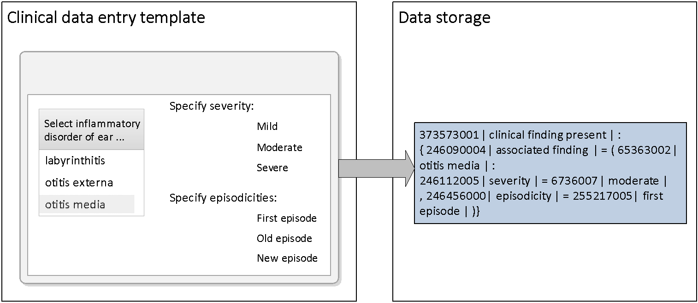

# 6.4.2. Refinement of Concept Model Attributes

The application should also allow a user to refine the meaning of a selected Concept by selecting and applying a value to one of the attributes applicable to that type of concept. The set of permitted attributes is defined by the SNOMED CT concept model. The concept model also defines the range of values that can be applied to sanctioned attributes 

**Example:**

For a clinical finding such as | otitis media | it is possible to specify different values, for the following attributes | severities |, | episodicities | and | courses |.

The illustration below show how a user interface can support entry of qualifier values, and how the selection can be represented by a single SNOMED CT expression. 

<figure><figcaption>
Figure 6.4.2-1: Refinement using a of data entry template
</figcaption></figure>

# Constraints on the Entry of Invalid Qualifiers

Qualifiers must only be used where the result of applying them results in a true subtype of the original Concept. Therefore, qualifiers should **not** be used for the purposes listed in [Table 6.4.2-1](https://confluence.ihtsdotools.org/display/DOCSEARCH/6.4.2.+Refinement+of+Concept+Model+Attributes#Table-deprecated-uses-of-qualifiers "Deprecated Uses of Qualifiers").These and similar major modifications need to be handled in ways that are explicit and ensure that queries and decision support protocols are able to accurately retrieve and analyze the available information. 

Table 6.4.2-1: Deprecated Uses of Qualifiers

Deprecated Use | **Example**|  Notes  
---|---|---  
**Negation**|  | Fracture of humerus | must not be qualified by "excluded." | It would be inappropriate for data retrieval to treat this as a subtype of the clinical finding | Fracture of humerus |.  
**Certainty**|  | Carcinoma of cervix | must not be qualified by "possible." | It would be inappropriate for data retrieval to treat this as a subtype of the diagnosis of | Carcinoma of cervix |.  
**Subject of information**|  | Diabetes mellitus | should not be qualified by "family history." | It would be inappropriate for data retrieval to treat this as a subtype of the diagnosis of | Diabetes mellitus | in the patient.   
**Planning stage**|  | Hip replacement | should not be qualified by "planned" or "requested." | It would be incorrect for a count of "Hip replacement" operations performed to include this. Decision support protocols should not assume the patient has had this operation. 
