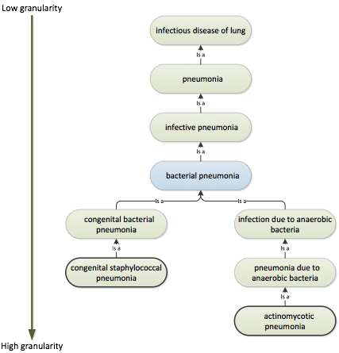
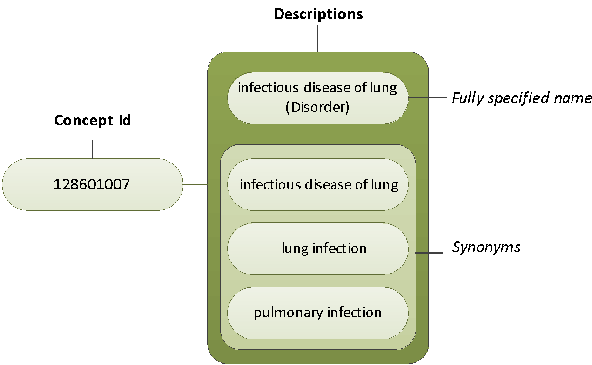
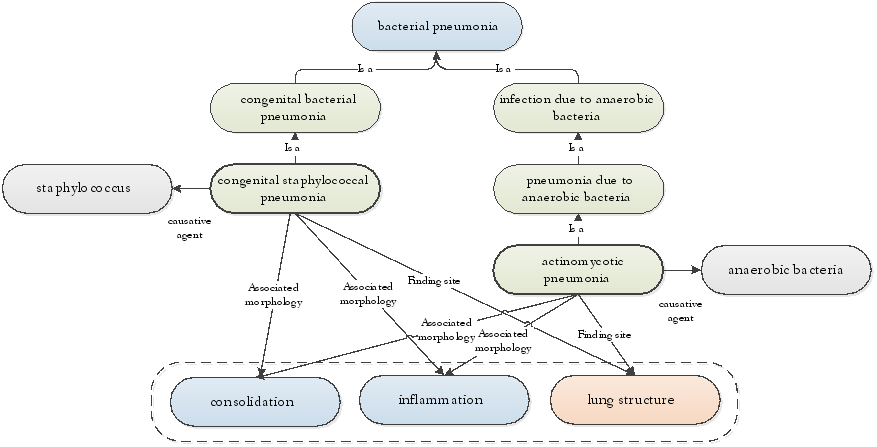

# Benefits of Using SNOMED CT for Data Entry

Here are some of the benefits of using SNOMED CT for Data Entry

## Specificity and Generalization

SNOMED CT hierarchies are subtype hierarchies (made up of 'is a' relationships) that allow for clinical information to be entered at a level of detail sufficient for the specific clinical situation or possible at the given point in time.

For example, it is possible to specify a clinical finding at very high level of detail, which is relevant and important for clinical treatment. The 'is a' relationships allow for SNOMED CT hierarchies to be automatically traversed, and to enable terminological reasoning of common sub- and supertypes. This means that Concepts can be automatically aggregated into more general types, which is useful for management purposes and for statistics.

### **Example:**

Traversing the supertype hierarchies of the two concepts <mark style="color:blue;">|</mark> actinomycotic pneumonia <mark style="color:blue;">|</mark> and <mark style="color:blue;">|</mark> congenital bacterial pneumonia <mark style="color:blue;">|</mark> will show that both Concepts are types of <mark style="color:blue;">|</mark> bacterial pneumonia <mark style="color:blue;">|</mark>.

<figure><figcaption>
Figure 6.1.1-1: The subtype hierarchies link specific detailed concepts to general concept with less granularity
</figcaption></figure>

## Clinical Language and Coding

The unique Concept identifiers of SNOMED CT Concepts are numeric identifiers and do not contain information related to the meaning of a Concept or Description. This means it is not possible to infer anything about the meaning of a Concept from the numeric value of the Identifier or from the sequence of digits that form the identifier.

The meaning of a Concept can be determined from relationships to other Concepts and from associated Descriptions that include human readable terms. In the context of data entry, this means that entering SNOMED CT Concepts must be done by using associated Concept Descriptions, and hence by use of the clinical spoken language instead of using the Concept codes for data entry.

<figure><figcaption>
Figure 6.1.2-1: SNOMED CT Descriptions support the use of clinical language for documentation and the synonyms support flexibility in the terms used to represent the Concepts
</figcaption></figure>

Additionally, SNOMED CT allows for coding different Descriptions that belong to the same Concepts. This support flexible data entry, by enabling the possible to use the Descriptions preferred in a specific organization or within a specific user group.

## Data Entry as Foundation for Meaning-Based Retrieval

Use of SNOMED CT for data entry has implications for how clinical data can be used and retrieved. The SNOMED CT relationships support meaning-based retrieval of clinical data, which can be useful for creating specific clinical overviews or for aggregating data with specific characteristics (meaning).

The figure below shows some of the defined relationships that are included in SNOMED CT to define the two Concepts <mark style="color:blue;">|</mark> actinomycotic pneumonia <mark style="color:blue;">|</mark> and <mark style="color:blue;">|</mark> congenital bacterial pneumonia <mark style="color:blue;">|</mark>. The Concepts have different causative agents; however the associated morphology and the finding site of the findings are equivalent. This means, that both Concepts would be part of a result of queries that retrieve clinical findings with the finding site <mark style="color:blue;">|</mark> lung structure <mark style="color:blue;">|</mark> and the associated morphology <mark style="color:blue;">|</mark> inflammation <mark style="color:blue;">|</mark> or <mark style="color:blue;">|</mark> consolidation <mark style="color:blue;">|</mark>.

<figure><figcaption>
Figure 6.1.3-1: Meaning based retrieval
</figcaption></figure>

Such types of meaning-based queries are possible to develop because of the integrated clinical meaning which is made explicit by the defined relationships. Terminological reasoning therefore makes it possible to develop queries that retrieve all Concepts with a specific meaning. In many cases this approach is much more effective and efficient than manually specifying which Concepts to retrieve based on the unique Concept Id's.

## Effective and Consistent Data Entry

SNOMED CT can support consistent data entry. The unique Concept Identifiers support unambiguous representation of the clinical content applied in Clinical Information Systems.

However, the flexibility of SNOMED CT allows entering expressions in various ways which may hamper consistency and retrieval. Structured data entry mechanisms such as, having a pre-defined set of Concepts for a specific clinical data entry field in a form can constrain the number of Concepts visible to documenting clinicians and enhance consistent use of SNOMED CT Concepts. \[see [Examples of applied mechanisms of structured data entry](6.2-structured-data-entry.md#examples-of-applied-mechanisms-of-structured-data-entry)]

Therefore it is important that each SNOMED CT-implementation includes strategies for how to balance the flexibility of SNOMED CT when entering data into the clinical record.
