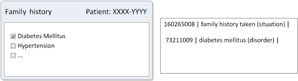
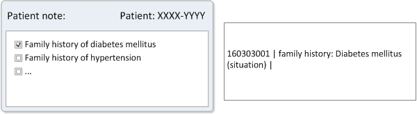
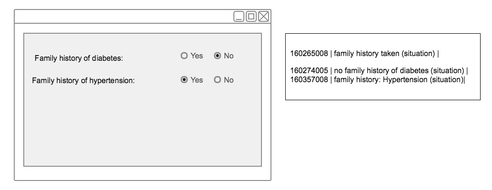
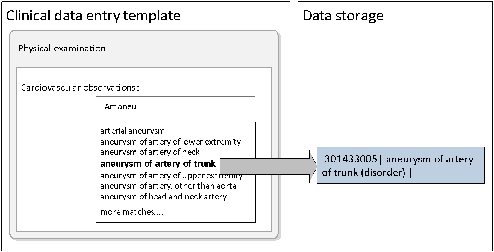
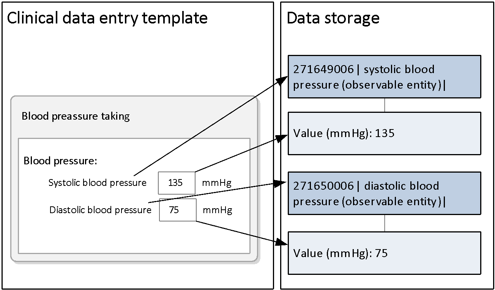
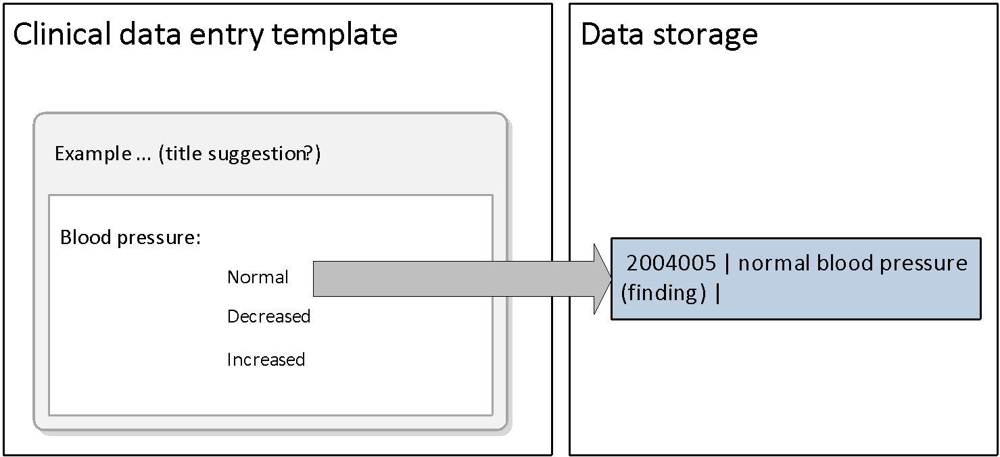
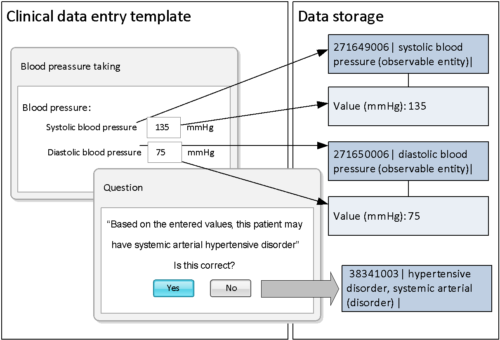
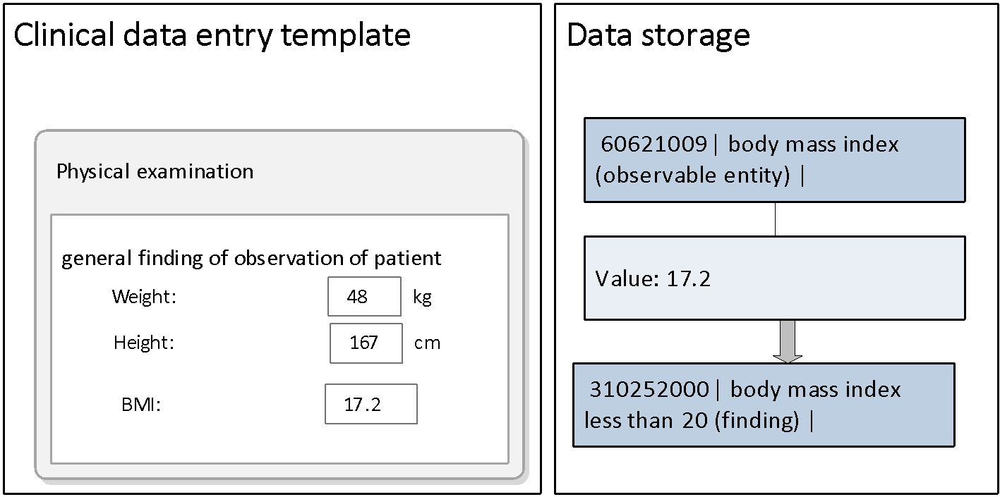

# Structured Data Entry

Structured data entry can be applied to support effective data entry and ensure consistent use of Concepts. When using structured data entry methods, SNOMED CT encoded data can be selected in a variety of ways. Some of these involve direct selection of terms while other ways involve encoding which may result from responses to simple choices or entry of particular data values. The sub-section below shows requirements for structured data entry and examples of mechanisms for data entry.

## Requirements for Structured Data Entry

Data entry needs to be easy in terms both of the time and effort required to record the information needed, but also easy in the way it fits in with working practices.

User interfaces should make it easy to enter data that includes SNOMED CT where this is required to enable effective retrieval and reuse. Hence, data capture is only worthwhile if the data captured can be usefully reused, and therefore data capture needs to be designed to meet requirements for subsequent retrieval.

SNOMED CT encoded data should be rendered in ways that are easily read and understood as part of the clinical record. Approaches to data entry therefore need to be tailored to the way different groups of clinicians work and think. On the one hand, the application of SNOMED CT must be done by a common approach across the various user interfaces to support consistency. On the other hand, the system should not be designed as one size fits all, as this will decrease the applicability of the system. SNOMED CT supports flexible and user-oriented data entry mechanisms, allowing for detailed and very specific data entry as well as bridging different levels of granularities applicable for retrieval of common patterns.

Applying SNOMED CT in EHR has implications for how data can be utilized for effective clinical documentation, enhanced retrieval and decision support functionalities. To support effective display and analysis of SNOMED CT coded data, questions about an individual patient or a selected population must have answers that are:

* Accurate – no false negatives
* Precise – no false positives
* Timely – available when needed
* Efficient – without disproportionate cost, time and effort
* Consistent – independent of how the data was entered

To meet the above requirements, collected data must be stored in a consistent form that enables reliable retrieval.

## Balance Interface Design and Concept Selection

The way information is captured in the clinical record can differ between systems. The choice of Concepts and their representation in the record has implication for interpretation and retrieval.

Requirements for data retrieval are an important determinant of requirements for data content and representation, and the following two overall guidelines can be used to govern the Concept selection and representation:

* To support effective reuse a health record must make it possible to answer relevant questions accurately and efficiently;
* To answer relevant questions information must be selectively retrieved so it can be displayed or analysed.

As the following examples illustrate, the same information (clinical meaning) may be captured in different ways. If information is represented according to the way it is captured it may be difficult to answer simple questions.

_A question such as 'does the patient have a family history of diabetes mellitus?' can expand to:_

1. Do they have a family history form in which 'diabetes mellitus' is checked as present?
2. Do they have a family history record in which the code for 'FH diabetes mellitus' is present?
3. Do they have text that is tagged with the code for 'diabetes mellitus' in the context of a section of text tagged as 'family history'?
4. _… n. There are also many other possible data capture representations to consider_

## Default Context

Concepts in SNOMED CT carry a "soft-default" context, which means that, unless stated otherwise within the Description or the definition of the Concept, the term should be interpreted as follows:

For a clinical finding that:

* The finding has actually occurred (vs. being absent or not found).
* It is occurring to the subject of the record (the patient).
* It is occurring currently or at a stated past time.

For a procedure that:

* The procedure was completed.
* It was performed on the subject of the record (the patient).
* It was done in the present time or at a stated past time.

The only exceptions are Concepts whose Description actually contains a specific context (e.g. father smokes), and these are all grouped in a special hierarchy (situation with explicit context).

When recording in the patient record, post-coordinated expressions or free text should only be used to add additional detail to the coded item. They should never negate or modify the meaning of the coded item as this would fundamentally changes its meaning.

For example, free text phrases such as 'family history of', 'absent', 'not found' should not be applied to SNOMED CT coded data.

## Examples of Interface Design and Concept Selection

### Implicit and Explicit Meaning of Interface Terms

The illustrations below shows a template designed for the purpose of documenting diseases that occur in the patients familiy history.

The first template below shows a heading that specifies the context of the template, namely documentation of 'family history', whereas the checkboxes allow for specifying the family history of the disease. The direct (lexical) map between the interface term "Diabetes Mellitus" without considering the actual context will be the clinical finding Concept | Diabetes Mellitus (Disorder) |.

<figure><figcaption>
Family history form with interface term of implicit meaning
</figcaption></figure>

However, the appropriate Concept for data entry is the situation Concept | family history : Diabetes mellitus (situation) | based on the meaning of the interface term.

The form below shows a patient note with check boxes to enter diseases that occur in the patient's family history. Here, there is a direct (lexical) map between the interface term "family history : Diabetes mellitus" and the meaning of the interface term, | family history : Diabetes mellitus (situation) |.

<figure><figcaption>
Patient note form with interface term of explicit meaning
</figcaption></figure>

It is therefore a requirement that careful thought be given about the actual meaning of each entry when selecting Concepts to represent a data entry, regardless of the specificity (or correctness) of the interface term.

### Entry of Presence and Absence

The example below shows another typical way of documenting occurences or negations of specific findings. The interface terms 'yes' and 'no' can be mapped to the qualifier values | yes (qualifier value) | and | no (qualifier value) |. However, these Concepts are meaningsless without knowing the finding or situation to which they relate. The appropiate mapping for these entries would therefore be expressions that specify the presence or absence of the actual finding, situation, etc. In this example the Concepts that represent respectively 'Yes' and 'No' would be the situations | no family history diabetes (situation) | and | family history: Diabetes mellitus (situation) |.

<figure><figcaption>
Entry of presence and absence
</figcaption></figure>

## Examples of Applied Mechanisms of Structured Data Entry

### Short List of Options

User selects from a small list of possible Descriptions applicable to a particular field in a template or step in a protocol. A Simple Reference Set with corresponding Descriptions from a particular Language Reference Set may specify the set of applicable Descriptions.

<figure><figcaption>
Data entry using a simple reference set
</figcaption></figure>

### Longer Lists Require Effective Search Techniques

<figure><figcaption>
 Data entry using a large Reference set requires use of search techniques
</figcaption></figure>

See section [Optimizing Searches](<../4 optimizing-searches/>), for further information about effective search techniques.

### Binding a Concept to a Data Control Used for Entering a Numeric or Other Value

When a value is entered in this control it is labeled with the appropriate Concept Identifier and added to the record.

<figure><figcaption>
Data entry of numeric values
</figcaption></figure>

### Association of a Concept with Particular Options Presented by a Check Box, Option Button or Other Data Entry Control

<figure><figcaption>
Data entry using radio buttons / check lists
</figcaption></figure>

When selections are made using this control the appropriate Concept identifier is added to the record.

### Binding Concept to a Particular Combination of Values or the Result of a Computation Involving Several Items of Previously Entered Data

<figure><figcaption></figcaption></figure>

<figure><figcaption>
Two examples of how data entry of specific values can be foundation for automatic addition of appropriate SNOMED CT clinical findings
</figcaption></figure>

When specific values are entered the appropriate (defined) Concept identifier is added to the record. The above examples show how specific numeric values can lead to specific clinical findings, based on pre-defined rules.

The example below, illustrates that the BMI can be automatically calculated by the entered values for body weight and height. Moreover, it is possible to develop rule-based coding (i.e. algorithms that assign BMI values between 20 and 24 to the SNOMED CT Concept 35425004 <mark style="color:blue;">|</mark> normal body mass index <mark style="color:blue;">|</mark>, or to a more specific Concept 412768003 <mark style="color:blue;">|</mark> body mass index 20-24 - normal <mark style="color:blue;">|</mark>.

<table><thead><tr><th width="103.046875">Value</th><th>Concept</th></tr></thead><tbody><tr><td>&#x3C; 20</td><td>

<ul><li>6497000 <mark style="color:blue;">|</mark> decreased body mass index <mark style="color:blue;">|</mark></li></ul><ul><li>427090001 <mark style="color:blue;">|</mark> body mass index less than 16.5 <mark style="color:blue;">|</mark></li></ul><ul><li>310252000 <mark style="color:blue;">|</mark> body mass index less than 20 <mark style="color:blue;">|</mark></li></ul></td></tr><tr><td>25 &#x3C;</td><td>

<ul><li>48499001 <mark style="color:blue;">|</mark> increased body mass index <mark style="color:blue;">|</mark></li></ul><ul><li>162863004 <mark style="color:blue;">|</mark> body mass index 25-29 - overweight <mark style="color:blue;">|</mark></li></ul><ul><li>162864005 <mark style="color:blue;">|</mark> body mass index 30+ - obesity <mark style="color:blue;">|</mark></li></ul><ul><li>408512008 <mark style="color:blue;">|</mark> body mass index 40+ - severely obese <mark style="color:blue;">|</mark></li></ul></td></tr><tr><td>20 - 24</td><td>

<ul><li>35425004 <mark style="color:blue;">|</mark> normal body mass index <mark style="color:blue;">|</mark></li></ul><ul><li>412768003 <mark style="color:blue;">|</mark> body mass index 20-24 - normal <mark style="color:blue;">|</mark></li></ul></td></tr></tbody></table>

<a href="https://docs.google.com/forms/d/e/1FAIpQLScTmbZIf0UEQwYDkY27EEWBkaiYkHSbR0_9DmFrMLXoQLyL7Q/viewform?usp=pp_url&entry.1767247133=Search+And+Data+Entry+Guide&entry.670899847=Structured%20Data%20Entry" class="button primary">Provide Feedback</a>
