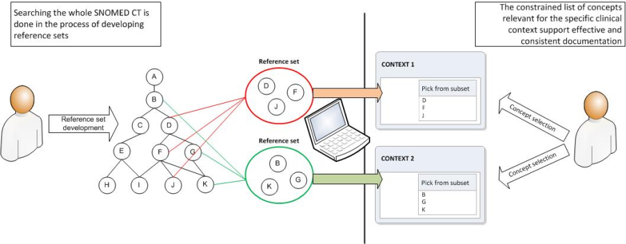

# Constraining Data Entry

Constraining searches refers to disabling Concepts or Descriptions in searches and navigation or allowing these search and navigation results to be filtered. \[See [Constrained Searches](../4-optimizing-searches/4.4-constrained-searches.md)] However, some Concepts and Descriptions that are suitable to be displayed as search results or navigation results, may not be suitable for recording in a patient record once search constraints have been applied. Constraining data entry refers to applying constraints so that only Concepts and Descriptions suitable for recording are selectable.

## Constraining Data Entry Based on Context

All fields (data elements) used for data entry must be analyzed to understand what underlying context is implied. The appropriate Concepts should then be selected for the value set of each field. Concepts from the Clinical Findings, Procedures, and Observable entities hierarchies can be used directly if the default assumptions are true. Otherwise, Concepts from the Context Dependent hierarchy should be selected to explicitly code the underlying context of the clinical idea.

Particular care must be taken with systems that enable real time post-coordinated constructs to ensure that the appropriate context attributes are included.

To pre-coordinate Concepts that do not already exist in SNOMED CT, care must also be taken to determine if any axis modification is shifting the meaning of a Concept. If so, it should be moved to the _Situation with explicit context_ hierarchy.

## Constrain Data Entry by Concept Description Status

Constraining data entry by Concept Status and Description Status should be done in order to avoid recording Concepts and Descriptions which for some reason have been inactivated. Inactive Concepts or Descriptions have been assessed to be unsuitable for recording. Therefore they should not be included as a possible result of a search, which would make them candidates for clinical recording.

## Constrain Data Entry According to Supertype Relevance

Constraining data entry according to supertype relevance is a technique that can support data entry, in which only particular sub-hierarchies that include Concepts relevant for the specific data entry point can be browsed or displayed.

### **Example :**

If a pick list in a data entry template should allow the selection, a specific "cardiopulmonary bypass operation", the SNOMED CT subtype hierarchy to specify what Concepts are to be included in the list, namely the descendants of the Concept "63697000 <mark style="color:blue;">|</mark> cardiopulmonary bypass operation <mark style="color:blue;">|</mark> ". Constraining data entry according to subtype relevance can be done using the transitive closure table, as shown in the figure below. The transitive closure table contains relationships to all supertypes ancestors of each defined Concept. A query for the set of Concepts, where the Concept "63697000 <mark style="color:blue;">|</mark> cardiopulmonary bypass operation <mark style="color:blue;">|</mark> "(shown as Concept B in the image below) is a supertype, will produce the constrained set of Concepts relevant for creating specific pick lists.

<figure><figcaption>
Using transitive closure to constrain data entry according to supertype relevance
</figcaption></figure>

Identifying selected portions of the SNOMED CT hierarchy may not be a sufficient constraint for entering data into a record. Constraining data entry through the use of Reference Sets may be more sufficient for producing the required set of Concepts relevant for data entry. \[see [Constrain data entry using Reference Sets](6.3-constraining-data-entry.md#constrain-data-entry-using-reference-set)].

## Constrain Data Entry Using Reference Sets

<figure><figcaption>
Constraining data entry using Reference Sets
</figcaption></figure>

In some cases, identifying selected portions of the SNOMED CT hierarchy may be a sufficient constraint for entering data into a record. However, it is not always sufficient if Concepts from multiple hierarchies are required, or if there is a need to hone the entry options from the full hierarchy. To meet these requirements applications should allow data entry to be constrained by Reference Sets.

Applications should be able to:

* Permit or prevent the entry of Concepts or Descriptions that are members of a specified Simple Reference Set.
* Permit entry of Concepts or Descriptions that are ordered in priority using the Ordered Reference Set.

### **Example:**

A UK GP practice implemented a clinical application with a data entry mechanism that:

* Prevents the entry of Concepts in a Simple Reference Set that contains all Concepts that are in the Non-Human Simple Reference Set so human Concepts can only be entered and stored in the clinical record;
* Enables the entry of Concepts in the "UK Administrative Reference Set" only when entering information in an administrative context.
* Enables the entry of Concepts in search results that is prioritized according to the order of disease prevalence using an Ordered Reference Set. Descriptions of Concepts associated with high disease prevalence are displayed before those with lower priority.

### **Example:**

A specialty system might prompt for confirmation when the user records a procedure not in a specified specialty Simple Reference Set.
