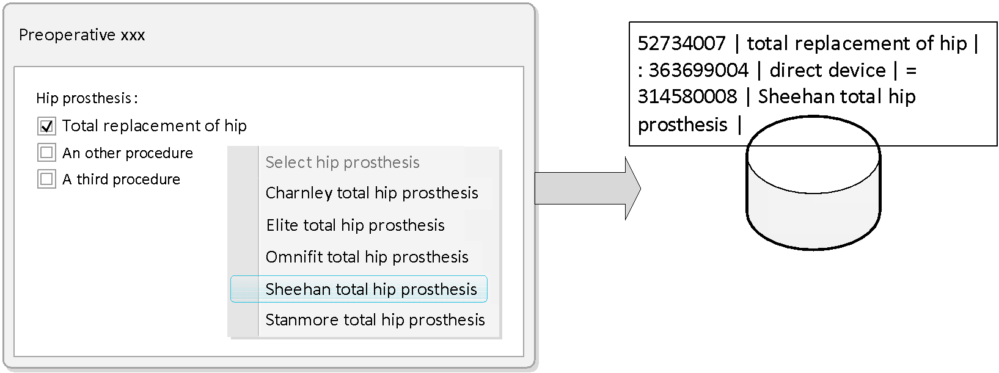
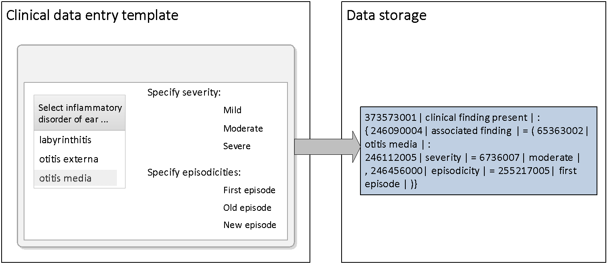
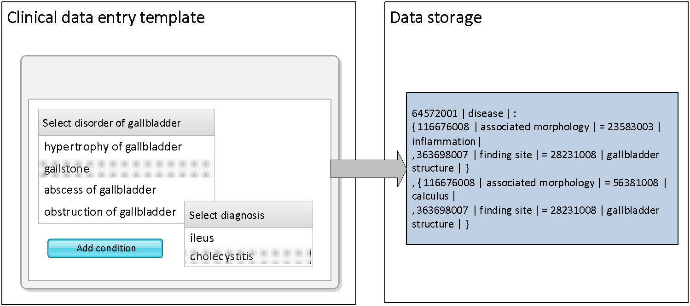

# Entering Refinements for Post-Coordinated Expressions

SNOMED CT contains Concepts that allow many clinical ideas to be represented by a single _Concept identifier_. However, SNOMED CT also allows more specific ideas to be represented even when they cannot be expressed by a single Concept. This is achieved by adding refinements to a selected Concept creating a post-coordinated expression containing several Concept Identifiers _._

Several types of post-coordinated data are outlined in this section from the perspective of data entry. These include refinement, qualification and combination. The requirements for and relevance of each of these will depend on decisions about data representation within patient records.

## Entry of Refined Defining Characteristics

The application may allow a user to refine a Concept by selecting a subtype of one of its defining characteristics. A defining characteristic is a relationship to a target Concept that is always necessarily true from any instance of the source Concept.

Refinement options may be entered by selecting from hierarchical lists showing subtype values. Simple lists or option buttons could support selection from limited sets of possible refinements. Wider ranges of possible refinement could be facilitated by text searches constrained to subtypes of one or more of the refineable characteristics.

### **Example:**

One of the defining characteristics the Concept <mark style="color:blue;">|</mark> total replacement of hip <mark style="color:blue;">|</mark> is <mark style="color:blue;">|</mark> using <mark style="color:blue;">|</mark> = <mark style="color:blue;">|</mark> hip prosthesis <mark style="color:blue;">|</mark>. The Concept <mark style="color:blue;">|</mark> total replacement of hip <mark style="color:blue;">|</mark> could be refined by allowing the user to specify one of the subtypes of "hip prosthesis."

<figure><figcaption>
Entry of refined defining characteristics
</figcaption></figure>

## Refinement of Concept Model Attributes

The application should also allow a user to refine the meaning of a selected Concept by selecting and applying a value to one of the attributes applicable to that type of concept. The set of permitted attributes is defined by the SNOMED CT concept model. The concept model also defines the range of values that can be applied to sanctioned attributes

### **Example:**

For a clinical finding such as <mark style="color:blue;">|</mark> otitis media <mark style="color:blue;">|</mark> it is possible to specify different values, for the following attributes <mark style="color:blue;">|</mark> severities <mark style="color:blue;">|</mark>, <mark style="color:blue;">|</mark> episodicities <mark style="color:blue;">|</mark> and <mark style="color:blue;">|</mark> courses <mark style="color:blue;">|</mark>.

The illustration below show how a user interface can support entry of qualifier values, and how the selection can be represented by a single SNOMED CT expression.

<figure><figcaption>
Refinement using a of data entry template
</figcaption></figure>

### Constraints on the Entry of Invalid Qualifiers

Qualifiers must only be used where the result of applying them results in a true subtype of the original Concept. Therefore, qualifiers should **not** be used for the purposes listed in the table below. These and similar major modifications need to be handled in ways that are explicit and ensure that queries and decision support protocols are able to accurately retrieve and analyze the available information.

**Deprecated Uses of Qualifiers**

<table data-header-hidden><thead><tr><th width="149.7734375">Deprecated Use</th><th>Example</th><th>Notes</th></tr></thead><tbody><tr><td><strong>Negation</strong></td><td><mark style="color:blue;">|</mark> Fracture of humerus <mark style="color:blue;">|</mark> must not be qualified by "excluded."</td><td>It would be inappropriate for data retrieval to treat this as a subtype of the clinical finding <mark style="color:blue;">|</mark> Fracture of humerus <mark style="color:blue;">|</mark>.</td></tr><tr><td><strong>Certainty</strong></td><td><mark style="color:blue;">|</mark> Carcinoma of cervix <mark style="color:blue;">|</mark> must not be qualified by "possible."</td><td>It would be inappropriate for data retrieval to treat this as a subtype of the diagnosis of <mark style="color:blue;">|</mark> Carcinoma of cervix <mark style="color:blue;">|</mark>.</td></tr><tr><td><strong>Subject of information</strong></td><td><mark style="color:blue;">|</mark> Diabetes mellitus <mark style="color:blue;">|</mark> should not be qualified by "family history."</td><td>It would be inappropriate for data retrieval to treat this as a subtype of the diagnosis of <mark style="color:blue;">|</mark> Diabetes mellitus <mark style="color:blue;">|</mark> in the patient.</td></tr><tr><td><strong>Planning stage</strong></td><td><mark style="color:blue;">|</mark> Hip replacement <mark style="color:blue;">|</mark> should not be qualified by "planned" or "requested."</td><td>It would be incorrect for a count of "Hip replacement" operations performed to include this. Decision support protocols should not assume the patient has had this operation.</td></tr></tbody></table>

## Entry of Concept Combinations

Combinations of Concepts in a single expression for data entry may be required in cases where a Concept that represents the full scope of an activity is not available. Facilities for combining Concepts in an expression should be implemented and used with care.

It is appropriate to use these facilities when the combined result is conceived as a single statement that could potentially be used in many different patient records. For example, a diagnosis of "gallstones with cholecystitis" could be entered by selecting the 235919008 <mark style="color:blue;">|</mark> gallstone (disorder) <mark style="color:blue;">|</mark> and then selecting 76581006 <mark style="color:blue;">|</mark> cholecystitis (disorder) <mark style="color:blue;">|</mark> and combining these in a [single statement](#user-content-fn-1)[^1].

<figure><figcaption>
Entry of concept combinations
</figcaption></figure>

It is not appropriate to use these constructs to attempt to express an entire encounter, episode or clinical history in a single statement. For example, if a patient is treated for "gallstones with cholecystitis" diagnosed by "ultrasonography of biliary tract" with a course of <mark style="color:blue;">|</mark> amoxycillin <mark style="color:blue;">|</mark> followed after the acute phase has resolved by a <mark style="color:blue;">|</mark> cholecystectomy <mark style="color:blue;">|</mark>, this should **not** be entered as a single complex post-coordinated statement combining the diagnosis, investigation and treatments

[^1]: There is also a pre-coordinated Concept <mark style="color:blue;">|</mark> Calculus of gallbladder with cholecystitis <mark style="color:blue;">|</mark> which is equivalent to this post-coordinated combination.
