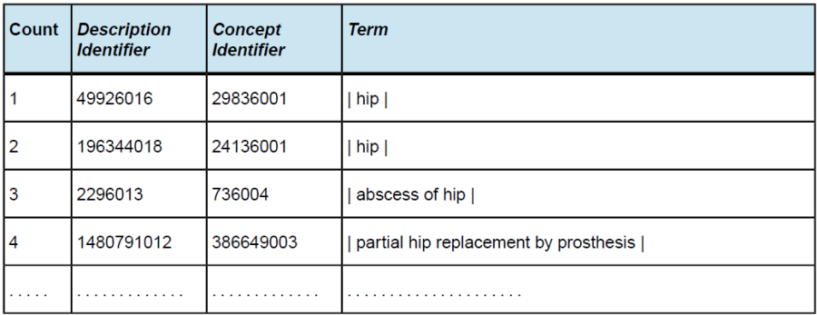
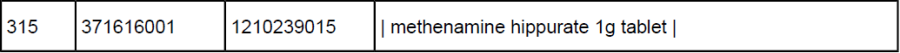
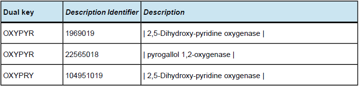

# Appendix A - Using Search Index Files

This appendix focuses on searches using two indexes (or tables), which can be found in the Lexical Resources folder, which is available from the [Technical Resources](https://confluence.ihtsdotools.org/display/DOC/Technical+Resources) in the [Document Library](https://confluence.ihtsdotools.org/display/ELPM/Document+Library). These indexes are designed to facilitate development of effective search facilities while reducing duplication of effort. Although indexes are available in the available files, implementers may need to know how to add keyword entries for any locally generated descriptions added as part of an Extension. Please refer to the "Generating the single key index" and "Generating the DualKey index" sub-sections in the Technical Implementation Guide for technical guidance on generating these indexes. 

# Search Using Single Keyword Index

The DescWordKey table is a single keyword index which is intended to enable searches which are independent of the order in which words appear in a Description. It represents the minimum necessary supporting structure for searches on SNOMED CT content. The single keyword index provides a pointer from each keyword used in any Description, to the Descriptions in which that keyword is used. This table is only useful for applications that utilise the English international release only. Note that some words that are used in _Description_ are stop words, which are unlikely to be in the target of a search. These words are not considered to be _keywords_ and may be excluded from the _keyword_ index. 

A single _keyword_ search may be conducted as follows: 

  * The user-typed search string is converted to consistent case;
  * The string is parsed, breaking at spaces and punctuation characters;
  * One word is selected from the parsed word list to use as a look-up on the single keyword index; 
  * Look-up on the single keyword index may be "exact" or "starts with," depending on wild card conventions used in the search string. 

**Example: Search using single key-word index**

The user searches for "Hip* replacement*" (where "*" represents the wild card for any number of extra characters). 

  * The user-typed search _string_ is converted to consistent case. 

"Hip* replacement" ? "HIP* REPLACEMENT*"

  * The _string_ is parsed, breaking at spaces and punctuation characters. 

**1.** "HIP* REPLACEMENT*" ? (1) "HIP*" 

**2.** (2) "REPLACEMENT*" 

  * Look up "HIP" on the single _keyword_ index using "starts with" _query_. 

Table Appendix A-1: Example results for a Search for "hip"

  

<figure></figure>

<figure><figcaption>
Descriptions in the search results are converted to consistent case and screened, to see if they contain any words starting with "REPLACEMENT" - only those terms that do are included in the final search results. Using a Dual Key index is more efficient as the same search finds only 11 matches.
</figcaption></figure>

Searches involving target words that appear in many Descriptions may be unacceptably slow if searches are carried out using the single keyword index alone. Developers wishing to produce applications with faster search times are encouraged to supplement their system with a multiple keyword index. 

# Search Using Multiple Keyword Index

The performance of single _keyword_ searches is highly dependent on the number of candidates. _Descriptions_ returned by the _keyword_ for subsequent filtering. The extremely high number of matches for some words in common use makes it likely that some searches will be unacceptably slow. 

One way to alleviate this problem would be to create a table containing rows for all combinations of word pairs in each _Description_. In some database environments that support optimization of multiple key searches, this may offer no benefits. However, in other environments, such a table may substantially speed searches. A comprehensive word pair table would be very large. Such a table covering the full content of _SNOMED CT_ would contain approximately 1.5 million unique word pairs and 6 million rows. 

Utilizing a multiple keyword index as a multiple keyword index limits the unique keys to the first three letter of each word thereby reducing the table size of the index to a more readily optimized set of keys. This requires the final part of the search to be conducted using text comparison (since the keys are incomplete). 

A search on the dual key index can only be carried out if the user enters a search _string_ that contains at least two word fragments both of which are three characters or more in length. If the search _string_ does not meet this criterion, the single _keyword_ search mechanism must be used. 

  * The user-typed search _string_ is converted to consistent case; 
  * The _string_ is parsed, breaking at spaces and punctuation characters; 
  * For each word of three characters or more, extract the first 3 characters, and arrange the word fragments in alphabetical _order_ ; 
  * Create a dual key by concatenating the first two 3 letter word fragments;
  * Use this dual key to look up exact matches on the word pair index;
  * _Descriptions_ found by searching on the word pair index are screened, to see if they contain the complete words in the original search _string_

**Example: Search using word pair index**

User searches for "PYRO* 1 OXYGEN*".

The _string_ is parsed, breaking at spaces and punctuation characters. 

**1.** "PYRO*"; 

**2.** 1; 

**3.** "OXYGEN*". 

For each word of three characters or more, extract the first 3 characters, and arrange the word fragments in alphabetical _order_. 

**1.** "OXY"; 

**2.** "PYR". 

Create a dual key by concatenating the first two 3 letter word fragments.

OXYPYR

Use this dual key to look up exact matches on the word pair index.

**Sample results of a search for "PYRO** 1 OXYGEN*"* 

<figure><figcaption>
Descriptions found by searching on the word pair index are screened, to see if they contain the complete words in the original search string:
</figcaption></figure>

  * Description, 1969019, is eliminated since it does not contain the word "1";
  * Description, 104951019, is eliminated; it does not contain the word "1" or any word beginning with the string "pyro". 

